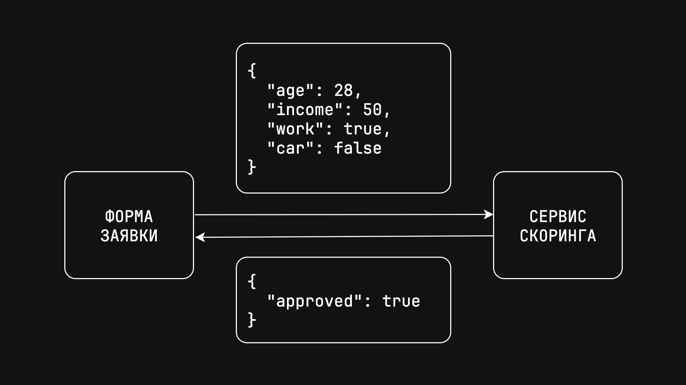
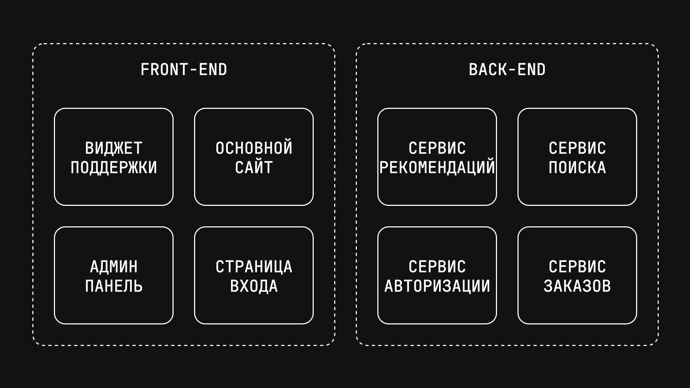
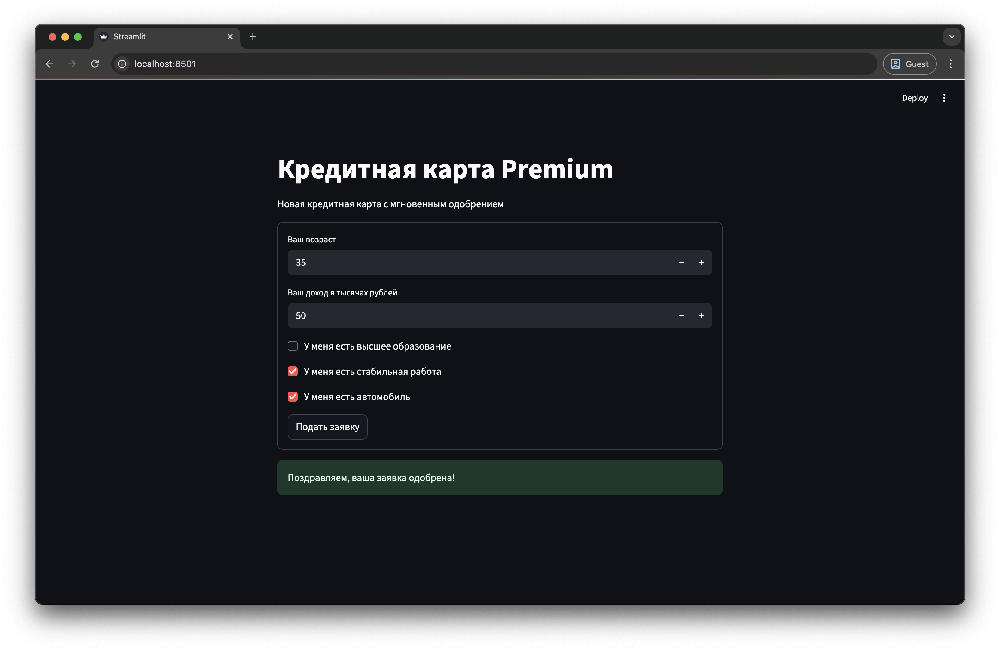

# Доводим проекты до конца — ML сервисы на FastAPI


Часто у вас бывало такое, что вы обучили ML модель, получили хорошие метрики, но не знаете что делать дальше? Или вам просто было интересно, что происходит после Jupyter ноутбуков на реальной работе? Сегодня мы это выясним и превратим вашу ML модель в полноценный коммерческий сервис.

<!-- more -->

Мы возьмем данные Т-Банка, обучим модель кредитного скоринга и создадим для нее API на FastAPI. К концу этого разбора у вас будет работающая система, которую можно обсудить на собеседовании. А в качестве бонуса мы сделаем для нее простой пользовательский интерфейс, чтобы протестировать всю систему со стороны конечного пользователя.

## Главная проблема {#problem}

Причина, по которой мы не знаем, что делать с моделями после Jupyter ноутбуков всего в одном шаге. С него всегда начинаются коммерческие проекты, но мы пропускаем его в своих проектах. 

Мы начинаем сразу в погружения в данные, ищем в них признаки, пропуски и корреляции, но не видим *проблему*. Вместо этого нужно сделать шаг назад и подумать — кому и зачем нужна ML модель для такой задачи? Ответ на этот вопрос и позволит превратить модель в продукт.

Для примера возьмем набор данных [соревнованияТ-Банка :octicons-link-external-16:](https://www.kaggle.com/competitions/fintech-credit-scoring/data){:target="_blank"} по кредитному скорингу. Посмотрите на его описание и скажите, что вы видите?

Все вроде бы просто — у нас есть анкетные данные клиента: зарплата, возраст, образование. И данные кредитного бюро: количество заявок, отказов и кредитный рейтинг.

По этим признакам нужно предсказать риск ухода клиента в дефолт. То есть, вероятность того, что клиент не сможет расплатиться по кредитам. Дефолт происходит редко, таких клиентов в выборке всего 10%.

Возможно, для начала стоит понять корреляцию признаков с целевой переменной, учесть дисбаланс классов и обучить простую модель, например логистическую регрессию.

И вот на этом моменте нужно остановиться. Это абсолютно правильно, но сейчас нам нужно взглянуть на эту задачу с точки зрения бизнеса. Для этого не нужно иметь опыт работы — достаточно потратить 15-20 минут на поиски или пообщаться с ChatGPT, чтобы понять основные сценарии использования моделей скоринга. Из них нужно выбрать один и превратить его в историю.

Например, представим, что Т-Банк запускает новую кредитную карту с большой рекламной кампанией. В банк придет огромное количество заявок на оформление кредитной карты. И большая часть из них поступит от новых клиентов, о которых банк почти ничего не знает. И среди этих клиентов могут быть те, кто не сможет платить по кредиту и уйдет в дефолт. Банк рискует потерять деньги.

Ситуация усугубляется тем, что менеджмент хочет повысить конверсию, и разрешает использовать только короткую анкету с минимальным количеством вопросов. И именно на этом шаге понадобится наша модель. Она должна быстро обрабатывать заявку нового клиента и возвращать статус заявки — одобрена или отклонена.

Посмотрим на задачу с точки зрения архитектуры. Front-end команда займется созданием формы. При нажатии на кнопку заявки данные с формы будут отправляться в сервис скоринга. Им займется Data Science команда — то есть мы.



Позже обсудим оба сервиса в деталях и разберем передачу данных подробнее. Но для начала нас просят проанализировать данные и обучить модель. Менеджеры хотят знать, какой процент заявок мы одобрим и сколько среди них будет клиентов с дефолтом.

## Обучение модели {#model}

Бизнес-контекст уже полностью изменил подход к задаче. В обычной ситуации мы бы попытались отобрать признаки исходя из их важности — используя SHAP, корреляцию с целевой переменной или другие методы. Но в данной ситуации приходится выбирать те признаки, которые клиенты смогут легко заполнить.

Посмотрим на данные еще раз:

| Поле              | Описание                                      |
|:------------------|:----------------------------------------------|
| `education_cd`    | Образование                                   |
| `gender_cd`       | Пол                                           |
| `age`             | Возраст                                       |
| `car_own_flg`     | Флаг наличия автомобиля                       |
| `car_type_flg`    | Флаг наличия иномарки                         |
| `appl_rej_cnt`    | Количество отказанных прошлых заявок          |
| `good_work_flg`   | Флаг наличия хорошей работы                   |
| `Score_bki`       | Скор балл по данным из бюро кредитных историй |
| `out_request_cnt` | Количество запросов в бюро                    |
| `region_rating`   | Рейтинг региона                               |
| `income`          | Доход заявителя                               |
| `Air_flg`         | Наличие загран паспорта                       |
| `default_flg`     | Флаг дефолта по кредиту                       |

Выбираем образование, возраст, наличие автомобиля, постоянной работы и уровень дохода. Пол не рассматриваем, чтобы избежать гендерной дискриминации. 

Данные в таком виде уже подготовлены в файле [:material-file: scoring.csv](../static/posts/fastapi/scoring.csv){:download=scoring.csv}, а полный код проекта [доступен на GitHub :octicons-link-external-16:](https://github.com/mouseml/credit_scoring){:target="_blank"}.

Создайте папку для проекта, внутри нее — папку `data` и положите в нее файл `scoring.csv` с исходными данными. Для обучения модели установим Pandas и Scikit-Learn. В терминале выполняем:

```shell
pip3 install pandas scikit-learn
```

Теперь создадим модуль `train.py`, импортируем Pandas, загрузим данные и отобразим первые 5 строк:

```python title="train.py"
import pandas as pd

data = pd.read_csv("data/scoring.csv")
print(data.head())
```
```{.text .no-copy}
   age  income  education  work  car  default
0   27      32          0     0    1        0
1   26      50          1     0    0        0
2   35      20          0     1    0        0
3   35      80          1     1    0        0
4   24      27          0     0    0        0
```

Разделим данные на матрицу признаков (все колонки, кроме `default`) и вектор целевых значений (оставшаяся колонка):

```python title="train.py" hl_lines="4-5"
import pandas as pd

data = pd.read_csv("data/scoring.csv")
X = data.drop(columns=["default"]).values
y = data["default"].values
```

Импортируем из `sklearn` функцию `train_test_split` и с ее помощью делим выборку на две части — выборку обучения (80% данных) и выборку валидации (20% данных):

```python title="train.py" hl_lines="2 7-9"
import pandas as pd
from sklearn.model_selection import train_test_split

data = pd.read_csv("data/scoring.csv")
X = data.drop(columns=["default"]).values
y = data["default"].values
X_train, X_test, y_train, y_test = train_test_split(X, y, test_size=0.2)
print(X_train.shape, X_test.shape)
print(y_train.shape, y_test.shape)
```
```{.text .no-copy}
(144652, 5) (36164, 5)
(144652,) (36164,)
```

В выборке обучения оказалось 144 тысячи случайных строк, а тестовой выборке — 36 тысяч.

В качестве модели используем логистическую регрессию. Импортируем класс `LogisticRegression`, инициализируем модель и передаем конструктору аргумент `class_weight="balanced"`. Это увеличит штраф за неверную классификацию клиентов с дефолтом примерно в 10 раз. Дальше вызываем метод `fit` для обучения модели:

```python title="train.py" hl_lines="3 10-11"
import pandas as pd
from sklearn.model_selection import train_test_split
from sklearn.linear_model import LogisticRegression

data = pd.read_csv("data/scoring.csv")
X = data.drop(columns=["default"]).values
y = data["default"].values
X_train, X_test, y_train, y_test = train_test_split(X, y, test_size=0.2)

model = LogisticRegression(class_weight="balanced")
model.fit(X_train, y_train)
```

Теперь нужно посчитать метрики на тестовой выборке. Импортируем функции `precision_score` и `recall_score`. Чуть позже объясню, что они значат, а сейчас посчитаем их для тестовой выборки. Выводим на экран процент положительных предсказаний модели — это часть заявок с вероятностью дефолта выше 50%. Эти заявки будут отклонены. Ниже выводим точность и полноту:

```python title="train.py" hl_lines="4 14-20"
import pandas as pd
from sklearn.model_selection import train_test_split
from sklearn.linear_model import LogisticRegression
from sklearn.metrics import precision_score, recall_score

data = pd.read_csv("data/scoring.csv")
X = data.drop(columns=["default"]).values
y = data["default"].values
X_train, X_test, y_train, y_test = train_test_split(X, y, test_size=0.2)

model = LogisticRegression(class_weight="balanced")
model.fit(X_train, y_test)

y_pred = model.predict(X_test)
precision = precision_score(y_test, y_pred)
recall = recall_score(y_test, y_pred)

print(f"Отказано: {y_pred.mean() * 100:.0f}%")
print(f"Точность: {precision * 100:.0f}%")
print(f"Полнота:  {recall * 100:.0f}%")
```
```{.text .no-copy}
Отказано: 55%
Точность: 14%
Полнота:  67%
```

Итак, судя по данным на тестовой выборке, наша модель будет отклонять чуть больше половины всех заявок. При этом только 14% заявок, по которым модель предсказывает дефолт, реально закончатся дефолтом — это показывает метрика *precision*. Зато модель позволит выявить 67% заявок клиентов с будущим дефолтом — это интерпретация метрики *recall*.

Значения обеих метрик довольно посредственные. Пока предположим, что менеджеров все устраивает. В [заключительной части](#steps) обсудим, как их можно улучшить, а пока сохраним ту модель, которая получилась. Импортируем библиотеку `joblib` и вызываем функцию `dump`. В качестве аргументов передаем ей модель и имя файла:

```python title="train.py" hl_lines="1 14"
import joblib
import pandas as pd
from sklearn.model_selection import train_test_split
from sklearn.linear_model import LogisticRegression
from sklearn.metrics import precision_score, recall_score

data = pd.read_csv("data/scoring.csv")
X = data.drop(columns=["default"]).values
y = data["default"].values
X_train, X_test, y_train, y_test = train_test_split(X, y, test_size=0.2)

model = LogisticRegression(class_weight="balanced")
model.fit(X_train, y_train)
joblib.dump(model, "model.pkl")
```

После перезапуска кода видим файл `model.pkl` в текущей директории. Это бинарный файл с моделью в том состоянии, которое получилось после обучения. Дальше ее достаточно будет загрузить и использовать для того, чтобы получать предсказания.

## FastAPI и сервисы {#fastapi}

Сейчас мы находимся именно на том шаге, на котором заканчивается большинство пет-проектов. Но наш проект только начинается. Теперь разберемся с тем, как разные части коммерческой инфраструктуры общаются между собой, и как мы можем создать такую инфраструктуру самостоятельно с помощью FastAPI.

Вы наверняка уже слышали о том, что системы условно разделяют на front-end и back-end. Front-end — это визуальная часть системы, с которой взаимодействует пользователь. Она должна быть понятной, красивой и быстро загружаться. А все тяжелые операции, такие как создание ленты рекомендаций, загрузка данных пользователя или содержимого корзины — все это выполняет back-end.

Причем и front-end, и back-end — это собирательные понятия, на самом деле они состоят из множества отдельных компонентов или *сервисов*. Это называют микросервисной архитектурой:



В отличие от *монолита*, который закрывает сразу все задачи, микросервисы разрабатывать намного проще. Каждым сервисом может заниматься небольшая команда, которой необязательно знать, как работают остальные компоненты. А если какой-нибудь сервис упадет (например, сервис поиска), никакой другой функционал не пострадает — сайт или приложение продолжат работать.

Единственная сложность в том, что всем этим сервисам, нужно как-то обмениваться информацией: отправлять друг другу задачи и получать ответы. Наша модель, которую мы превратим в отдельный сервис скоринга — тоже не исключение. И в большинстве случаев общение происходит по протоколу HTTP.

Если думаете, что это сложно, то нет. Вы пользуетесь HTTP запросами каждый день. Когда вы заходите на YouTube, вы отправляете HTTP запрос по адресу [youtube.com :octicons-link-external-16:](https://youtube.com){:target="_blank"}, а в ответ получаете HTML документ, который отображается в вашем браузере. 

Но так происходит общение только с пользователями, между собой сервисы обмениваются служебными сообщениями в JSON формате. Это почти то же самое, что Python словари. Ключами в JSON могут быть строки, а значениями — строки, числа, пропуски, булевские значения, списки и другие объекты:

```json title="user.json"
{
  "user": {
    "id": 123,
    "name": "Анна Иванова",
    "active": true,
    "settings": null,
    "tags": ["admin", "verified"]
  }
}
```

В нашем случае пользователь будет заполнять форму с личными данными. При нажатии на кнопку front-end передаст данные с формы в наш сервис, а сервис должен будет вернуть статус одобрения заявки.

На практике вся эта логика уместится в одной Python функции. Пока для простоты не будем ожидать никаких аргументов. Будем одобрять заявку случайным образом — 50/50. Возвращаем словарь с единственным ключом `approved` и статусом заявки:

```python title="service.py"
import random

def score():
    approved = random.choice([False, True])
    return {"approved": approved}
```

Теперь превратим эту функцию в сервис с помощью FastAPI. Сначала установим FastAPI с помощью команды:

```shell
pip3 install fastapi
```

Дальше импортируем класс `FastAPI`, создаем объект класса `FastAPI` и декорируем функцию `score` с помощью его метода `get`. В качестве аргумента передаем строку `"/score"`:

```python title="service.py" hl_lines="2-6"
import random
from fastapi import FastAPI

app = FastAPI()

@app.get("/score")
def score():
    approved = random.choice([False, True])
    return {"approved": approved}
```

Почему именно так сейчас обсудим, а пока запустим наш сервис. Просто запустить модуль командой `python3` не получится, для этого нам понадобится сервер `uvicorn`. Установим его с помощью команды:

```shell
pip3 install uvicorn
```

Для запуска выполняем команду: `uvicorn`, пробел, имя файла без расширения (в нашем случае `service`), двоеточие и имя переменной из декоратора:

```shell
uvicorn service:app
```
```{.text .no-copy}
INFO:     Started server process [30387]
INFO:     Waiting for application startup.
INFO:     Application startup complete.
INFO:     Uvicorn running on http://127.0.0.1:8000 (Press CTRL+C to quit)
```

Теперь переходим по ссылке в логах. Адрес `127.0.0.1` — это один из зарезервированных IP адресов, по которым система обращается сама к себе. Строка `/score`, которую мы использовали в декораторе, называется эндпойнтом, ее нужно добавить к адресу:

```text
http://127.0.0.1:8000/score
```

При переходе по этому адресу браузер выполняет HTTP запрос, в ответ на который мы получаем наше JSON сообщение со статусом заявки. Если обновить страницу, мы получим новый ответ со случайным статусом.

Теперь добавим возможность передавать в запросе данные клиента. Для этого нужно создать конструкцию, похожую на датакласс. Если вы не слышали ничего про датаклассы, просто повторяйте код из примера, все будет интуитивно понятно.

Импортируем класс `BaseModel` из библиотеки `pydantic` — она автоматически устанавливается вместе с FastAPI. Создадим класс `ClientData`, наследующий от `BaseModel`, и укажем все поля заявки вместе с их типом. Возраст (целое число), доход (число с плавающей точкой), наличие высшего образования, работы и машины (все три будут иметь логический тип):

```python title="service.py" hl_lines="3-10"
import random
from fastapi import FastAPI
from pydantic import BaseModel

class ClientData(BaseModel):
    age: int
    income: float
    education: bool
    work: bool
    car: bool

app = FastAPI()

@app.get("/score")
def score():
    approved = random.choice([False, True])
    return {"approved": approved}
```

Теперь поменяем метод `get` на `post`, добавим функции `score` аргумент `data` типа `ClientData` и обновим логику. Пока у нас нет ML модели, будем одобрять кредит только в случае, если зарплата в заявке больше 50 тысяч рублей или клиент имеет высшее образование и стабильную работу. К атрибутам обращаемся через точку:

```python title="service.py" hl_lines="13-15"
from fastapi import FastAPI
from pydantic import BaseModel

class ClientData(BaseModel):
    age: int
    income: float
    education: bool
    work: bool
    car: bool

app = FastAPI()
    
@app.post("/score")
def score(data: ClientData):
    approved = data.income > 50 or (data.education and data.work)
    return {"approved": approved}
```

Теперь эндпойнт `/score` будет ожидать, что вместе с запросом будут отправлены данные заявителя — JSON объект формате, который мы описали с помощью класса `ClientData`:

```json
{
  "age": 45,
  "income": 40,
  "education": false,
  "work": true,
  "car": true
}
```

Поэтому если мы перезапустим сервер и попробуем повторить запрос, то получим ошибку. К сожалению, тело запроса через адресную строку браузера передать нельзя. Но это можно сделать другими способами — обычно используют клиент [Postman :octicons-link-external-16:](https://www.postman.com){:target="_blank"} или страницу SwaggerUI, которую FastAPI создает автоматически. Сейчас воспользуемся именно ей.

Для перехода на эту страницу обращаемся к эндпойнту `/docs`:

```text
http://127.0.0.1:8000/docs
```

На этой странице перечислены все эндпойнты (в нашем случае всего один):


К каждому эндпойнту прилагается документация — в каком виде он ожидает запрос и какие ответы возвращает.

Здесь же можно отправить любой запрос. Для этого нужно нажать на кнопку "Try it out", ввести данные запроса и отправить запрос с помощью кнопки "Execute".

Сейчас можете потренироваться — попробовать ввести данные разных клиентов, поменять логику одобрения кредита, добавить к запросу больше полей или попробовать сделать запросы через Postman. Позже мы будем отправлять запросы прямо из Python кода.

## Сервис скоринга {#service}

Сейчас наш сервис почти готов, осталось добавить пару строчек кода, чтобы встроить в него обученную ML модель.

Импортируем библиотеку `joblib` и загружаем модель. Помещаем вызов `load` вне функции `score`. Так он выполнится только один раз при старте сервиса:

```python title="service.py" hl_lines="1 13"
import joblib
from fastapi import FastAPI
from pydantic import BaseModel

class ClientData(BaseModel):
    age: int
    income: float
    education: bool
    work: bool
    car: bool

app = FastAPI()
model = joblib.load("model.pkl")
    
@app.post("/score")
def score(data: ClientData):
    approved = data.income > 50 or (data.education and data.work)
    return {"approved": approved}
```

Теперь заменим `if/else` логику реальной моделью. Создаем список из данных запроса, помещая признаки клиента в том же порядке, в котором они были в выборке обучения. То есть сначала возраст, потом доход, образование, работа и наличие машины. Это очень важно — модель даст предсказание в любом порядке, но в неправильном порядке будет выдавать мусор. Вызываем метод `predict` и возвращаем предсказание:

```python title="service.py" hl_lines="1 13 17-18"
import joblib
from fastapi import FastAPI
from pydantic import BaseModel

class ClientData(BaseModel):
    age: int
    income: float
    education: bool
    work: bool
    car: bool

app = FastAPI()
model = joblib.load("model.pkl")
    
@app.post("/score")
def score(data: ClientData):
    features = [data.age, data.income, data.education, data.work, data.car]
    approved = model.predict([features])[0].item()
    return {"approved": approved}
```

Перезапускаем сервис и снова переходим на страницу документации, чтобы протестировать нашу систему. Можете попробовать разные комбинации — молодой клиент с высоким доходом, пожилой клиент или человек средних лет со стабильной работой, но без высшего образования. Теперь это настоящий сервис скоринга.

## Форма заявки {#ui}

Наш сервис работает, но пока им могут пользоваться только разработчики, и конечный продукт не то чтобы впечатляет. Если бы это был реальный проект, форму для подачи заявки на кредитную карту для нас бы уже подготовила front-end команда. Но для пет-проекта мы можем написать простую интерактивную веб-страницу прямо на Python.

Для этого используем фреймворк [Streamlit :octicons-link-external-16:](https://www.streamlit.io){:target="_blank"}. Тут сразу оговорюсь — это не настоящая front-end разработка, а скорее быстрый способ создать красивый прототип. То есть как раз наш случай.

Для начала установим зависимости — `streamlit` и `requests` для отправки HTTP запросов:

```shell
pip3 install streamlit requests
```

Для страницы создадим отдельный модуль `app.py`. Импортируем `streamlit` и вызываем функции `title` и `write` для создания заголовка и текста:

```python title="app.py"
import streamlit as st

st.title("Кредитная карта Premium")
st.write("Новая кредитная карта с мгновенным одобрением")
```

В Streamlit вызов каждой функции добавляет на страницу новый элемент. Элементы будут расположены в том же порядке, в котором были вызваны функции. То есть сначала заголовок, потом текст.

Чтобы запустить приложение, выполняем команду:

```shell
streamlit run app.py
```

После этого Streamlit откроет новую вкладку с приложением. Пока здесь только статичные компоненты:


Добавим форму с вопросами. Для создания формы используем контекстный менеджер `form`, передаем ему название формы. Внутри контекстного менеджера по очереди вызываем несколько функций. Для указания возраста и уровня дохода используем функцию `number_input`, в качестве аргументов передаем строку с подсказкой и минимальное значение — 18 лет и 0 рублей. Для вопросов с ответом да/нет используем функцию `checkbox`:

```python title="app.py" hl_lines="6-11"
import streamlit as st

st.title("Кредитная карта Premium")
st.write("Новая кредитная карта с мгновенным одобрением")

with st.form("Подать заявку"):
    age = st.number_input("Ваш возраст", min_value=18)
    income = st.number_input("Ваш доход в тысячах рублей", min_value=0)
    education = st.checkbox("У меня есть высшее образование")
    work = st.checkbox("У меня есть стабильная работа")
    car = st.checkbox("У меня есть автомобиль")
```

Возвращаемся в браузер и обновляем страницу. Теперь тут есть интерактивные элементы, с которыми пользователь может взаимодействовать:


Обратите внимание, что результату каждого вызова мы присвоили свою переменную. Значения этих переменных будут равны текущему состоянию соответствующих компонентов.

Добавим кнопку отправки формы с помощью функции `form_submit_button`. Переменная `submit` будет равна `True` если в текущей сессии пользователь нажал на кнопку. В этом случае пока просто выведем объект с данными заявки на экран:

```python title="app.py" hl_lines="12-22"
import streamlit as st

st.title("Кредитная карта Premium")
st.write("Новая кредитная карта с мгновенным одобрением")

with st.form("Подать заявку"):
    age = st.number_input("Ваш возраст", min_value=18)
    income = st.number_input("Ваш доход в тысячах рублей", min_value=0)
    education = st.checkbox("У меня есть высшее образование")
    work = st.checkbox("У меня есть стабильная работа")
    car = st.checkbox("У меня есть автомобиль")
    submit = st.form_submit_button("Подать заявку")

if submit:
    data = {
        "age": age,
        "income": income,
        "education": education,
        "work": work,
        "car": car,
    }
    st.write(data)
```

Теперь осталось отправить заявку в наш сервис скоринга и получить ответ. Для этого импортируем библиотеку `requests`, вызываем функцию `post` и передаем ей два аргумента — эндпойнт скоринга и данные запроса. Чтобы получить словарь с ответом от сервиса, вызываем метод `json` объекта `response`:

```python title="app.py" hl_lines="1 23-24"
import requests
import streamlit as st

st.title("Кредитная карта Premium")
st.write("Новая кредитная карта с мгновенным одобрением")

with st.form("Подать заявку"):
    age = st.number_input("Ваш возраст", min_value=18)
    income = st.number_input("Ваш доход в тысячах рублей", min_value=0)
    education = st.checkbox("У меня есть высшее образование")
    work = st.checkbox("У меня есть стабильная работа")
    car = st.checkbox("У меня есть автомобиль")
    submit = st.form_submit_button("Подать заявку")

if submit:
    data = {
        "age": age,
        "income": income,
        "education": education,
        "work": work,
        "car": car,
    }
    response = requests.post("http://127.0.0.1:8000/score", json=data)
    st.write(response.json())
```

Теперь при нажатии на кнопку мы должны увидеть ответ сервиса скоринга. Вместо этого подберем сообщение в зависимости от значения под ключом `approved`. Например, "Поздравляем, ваша заявка одобрена!" в случае одобрения или "Подобрали для вас дебетовую карту с 3% кэшбеком" в случае отказа. В обоих случаях используем функцию `success` — она отображает сообщение в зеленой рамке:

```python title="app.py" hl_lines="24-27"
import requests
import streamlit as st

st.title("Кредитная карта Premium")
st.write("Новая кредитная карта с мгновенным одобрением")

with st.form("Подать заявку"):
    age = st.number_input("Ваш возраст", min_value=18)
    income = st.number_input("Ваш доход в тысячах рублей", min_value=0)
    education = st.checkbox("У меня есть высшее образование")
    work = st.checkbox("У меня есть стабильная работа")
    car = st.checkbox("У меня есть автомобиль")
    submit = st.form_submit_button("Подать заявку")

if submit:
    data = {
        "age": age,
        "income": income,
        "education": education,
        "work": work,
        "car": car,
    }
    response = requests.post("http://127.0.0.1:8000/score", json=data)
    if response.json()["approved"]:
        st.success("Поздравляем, ваша заявка одобрена!")
    else:
        st.success("Подобрали для дебетовую карту с 3% кэшбеком.")
```

Это финальная версия системы:



Несмотря на все упрощения, можно сказать, что именно таким образом ML модели интегрируются в абсолютное большинство реальных продуктов. Текущую версию проекта можете закоммитить на GitHub или наоборот, забрать [мою версию :octicons-link-external-16:](https://github.com/mouseml/credit_scoring){:target="_blank"}.

## Следующие шаги {#steps}

Теперь обсудим несколько конкретных шагов на случай, если вы захотите добавить этот проект в свое портфолио.

Первое, на что стоит обратить внимание — нашему сервису не хватает гибкости. Представьте, что на следующий день после запуска продукта к вам подходит менеджер и говорит, что 45% одобренных заявок теперь считается слишком рискованной стратегией. Вам нужно оставить текущую модель, но одобрять на 15% меньше заявок.

Для этого нужно либо возвращать вероятность дефолта клиента — а в этой бизнес-логике пусть разбирается кто-то еще. Либо добавить максимальный риск дефолта в качестве параметра и одобрять заявки только ниже этого порога.

В этом случае вы будете совмещать [body параметры :octicons-link-external-16:](https://fastapi.tiangolo.com/tutorial/body/){:target="_blank"} и [query параметры :octicons-link-external-16:](https://fastapi.tiangolo.com/tutorial/query-params/){:target="_blank"}. Поэтому чтобы лучше понимать, что происходит, советую про них прочитать в [официальной документации :octicons-link-external-16:](https://fastapi.tiangolo.com){:target="_blank"} FastAPI — она доступна на всех языках. Также изучите виды запросов (`GET`, `POST`, `PUT` и `DELETE`) и статус коды. Это необходимый минимум, который пригодится вам в дальнейшем.

На аутентификацию и авторизацию пока можете не тратить время. Наш сервис будет находиться в закрытом контуре, куда априори не могут дойти запросы из внешнего интернета. Эти темы будут важны только для back-end разработчиков.

Что касается самой ML модели, тут я думаю вы догадываетесь. Стоит провести нормальный разведочный анализ данных, попробовать разные модели и сделать минимальный препроцессинг, как минимум прологарифмировать доходы. Но именно с таким набором признаков вряд ли получится сильно улучшить результаты даже с помощью бустинга.

Поэтому возможно сейчас стоит оставить простую и интерпретируемую модель и подумать над тем, как система могла бы обращаться за дополнительными данными о клиенте. Например, имея паспортные данные, можно сделать запрос в кредитное бюро. В нашем наборе данных эта информация есть, а кредитное бюро могла бы симулировать SQL таблица или отдельный сервис.

Также стоит задуматься о контейнеризации проекта — каждую часть системы стоит обернуть в Docker образ со своими зависимостями. Если вы ничего не поняли — не страшно, все эти шаги мы разберем на примере разных проектов в следующих разборах.

Поэтому добавляйте сайт в закладки, подписывайтесь на [YouTube канал :octicons-link-external-16:](https://www.youtube.com/channel/UCscWjyvPudzdIaGCCtEL3nw){:target="_blank"} и заходите пообщаться в [Telegram :octicons-link-external-16:](https://www.t.me/ml_mouse){:target="_blank"}. Увидимся в код ревью, всем пока!
