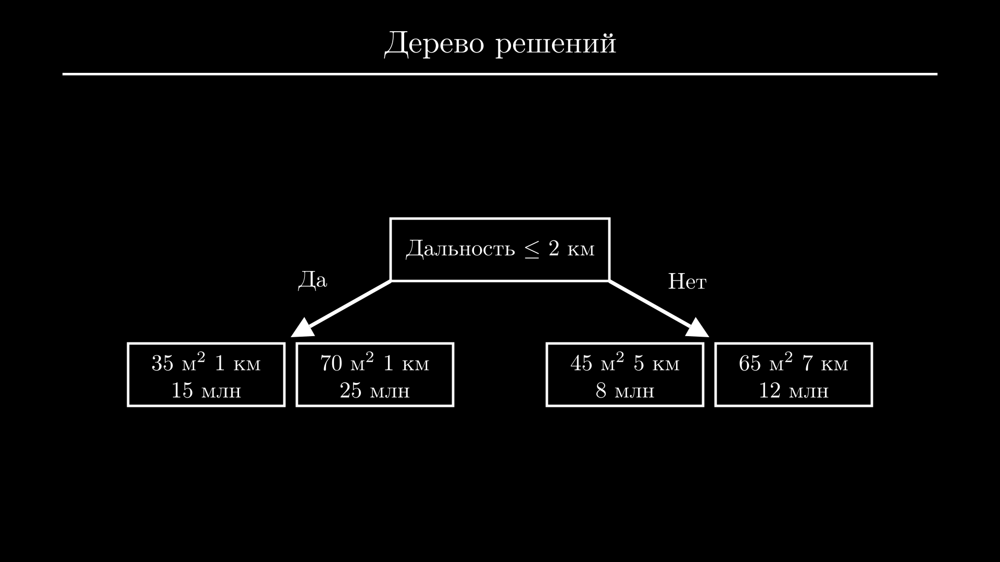
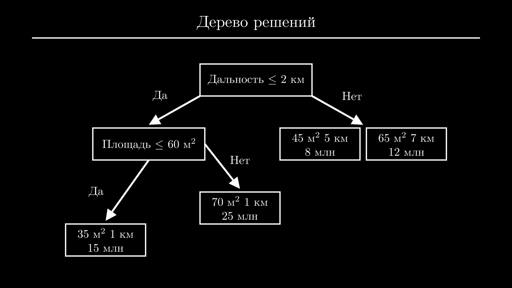
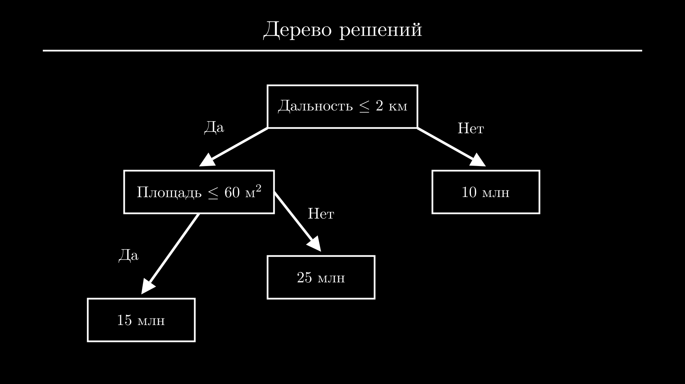
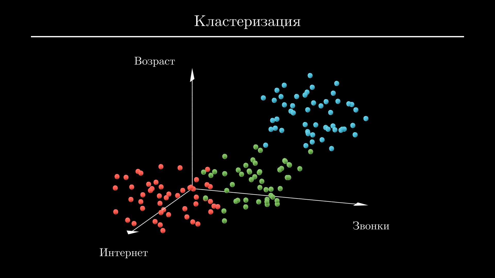
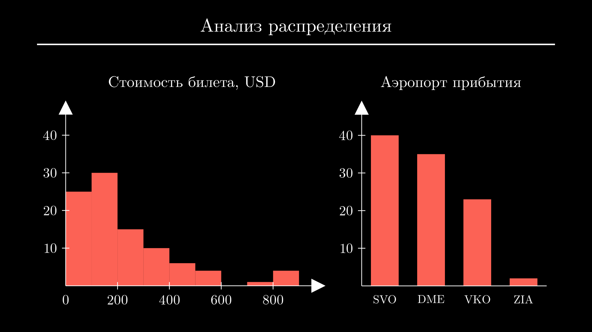
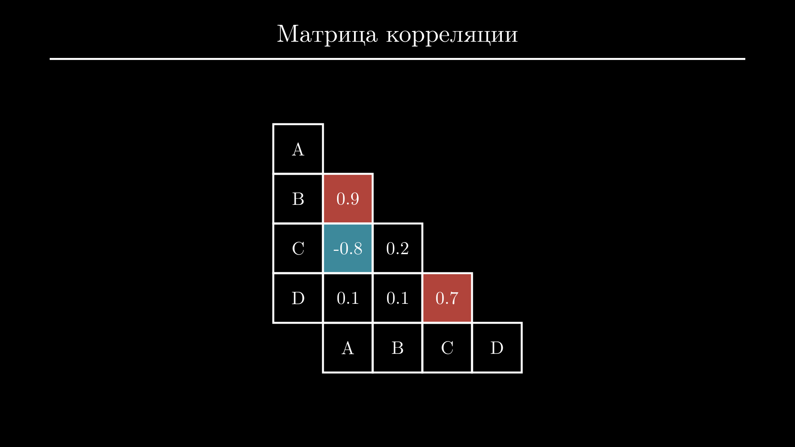
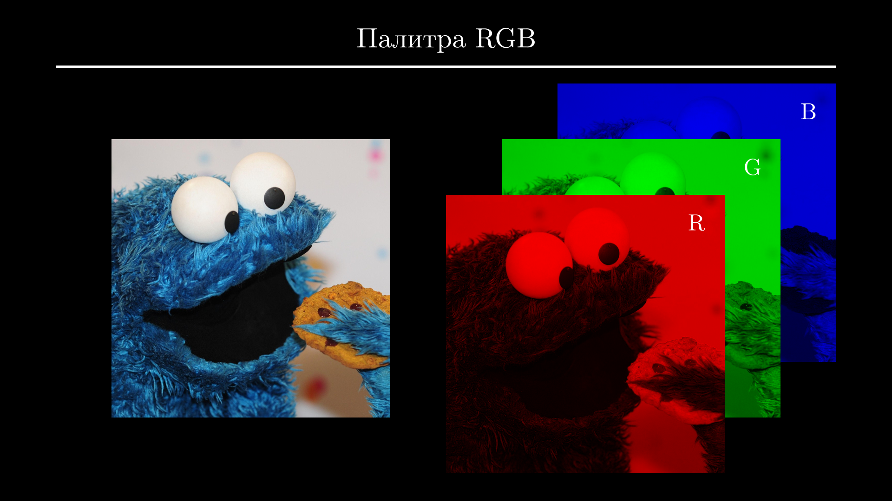
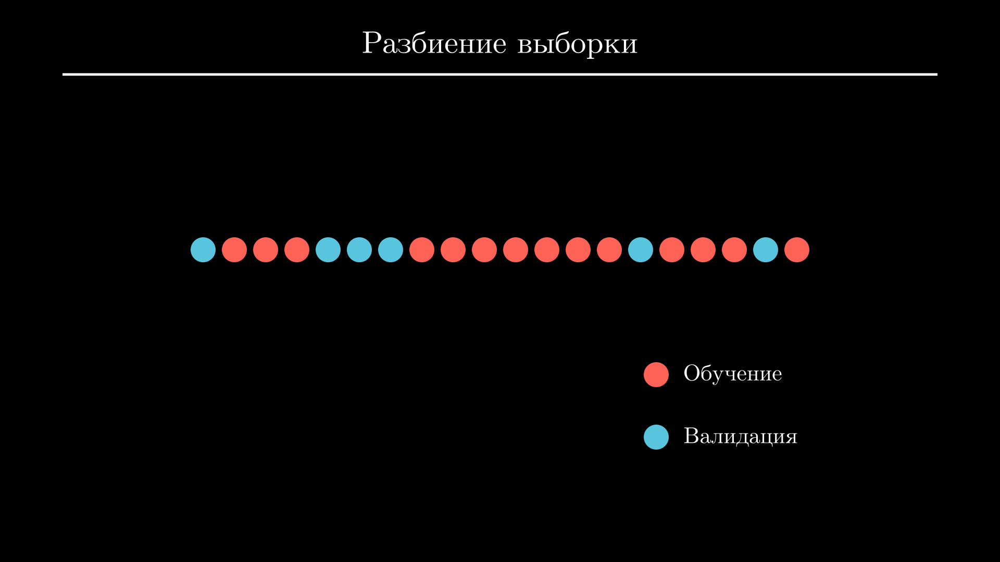
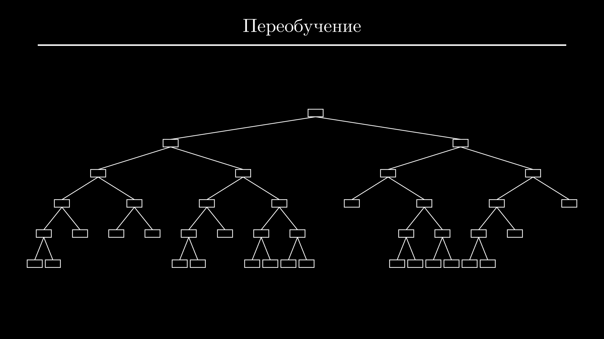

# Машинное обучение — все что нужно знать


Погружаемся в машинное обучение. Учимся смотреть на задачи глазами Data Scientist-а, изучаем основные модели — да, это не только нейросети — и этапы ML проектов. Также поговорим о том, с какими проблемами вы будете постоянно сталкиваться, правда ли так важно знать математику и с чего лучше начать обучение.

<!-- more -->

## Что такое ML {#ml}

Начнем с того, что такое ML. Если вы, как и я родились уже после того, как компьютеры превратились в основной источник дофамина, напомню, что изначально они задумывались как устройства для автоматизации рутинных задач. Только нюанс в том, что некоторые задачи хорошо поддаются автоматизации, а другие — не очень. И дело тут не в сложности. 

Например, вы без труда найдете софт, чтобы посчитать количество рулонов обоев, ежемесячный платеж по ипотеке или провести симуляцию течения жидкости в воздухозаборнике. Все это задачи разной сложности, но их объединяет то, что для их решения можно прописать четкий алгоритм.

А если вы спросите у оценщика недвижимости, каким алгоритмом он пользуется для определения рыночной стоимости квартиры, то в ответ услышите не только общие закономерности, но и кучу тонкостей и исключений из правил. То же самое касается и других задач, например, одобрения кредита исходя из данных и кредитной истории клиента, идентификации спама или мошеннических операций по карте, выставления диагноза по результатам анализов и истории болезни пациента и так далее.

Кроме задач, требующих глубоких экспертных знаний, тяжело поддаются автоматизации и обыденные задачи, связанные с обработкой зрительной и звуковой информации и речи. Отличить птицу от самолета на картинке и понять эмоциональную окраску предложения сможет даже ребенок, но придумать строгий набор правил, по которым он это делает кажется практически невозможным. Как бы вы не пытались проанализировать форму и цвет скопления пикселей и составить список плохих и хороших слов, всегда найдется огромное количество примеров, в которых ваш алгоритм не сработает.

Как вы уже поняли, все это примеры задач, с которыми отлично справляется машинное обучение. И его ключ к успеху — в данных. У нас может не быть хорошего алгоритма оценки стоимости недвижимости, но у банков будут данные о тысячах совершенных сделок. О мошеннических операциях и спаме клиенты в первую сообщают в поддержку. А пользователи в соцсетях сами подписывают каждое загруженное изображение.

Часто даже базовый анализ данных бывает полезен сам по себе — вы можете посмотреть отчет банка и обнаружить, что с каждым месяцем тратите больше денег на развлечения, хотя в моменте это незаметно. Или сервис почты может определить, что с некоторых почтовых ящиков в последние часы начал поступать спам и заблокировать их. 

Естественно, более продвинутый статистический анализ дает возможность находить скрытые, неочевидные закономерности и даже принимать на их основе решения. Этим занимаются дата аналитики и бизнес аналитики. А принятие решений на основе сформировало отдельный подход — Data-Driven Decision Making или DDD.

Но машинное обучение пошло еще дальше. Если у нас достаточно данных о предыдущих решениях задачи, мы можем обучить ML модель, которая заменит алгоритм решения задачи. ML модель можно представить как функцию с параметрами. В процессе обучения значения параметров автоматически подбираются таким образом, чтобы на известных нам данных модель давала наименьшее возможное отклонение от правильных решений задачи.

Чтобы стало понятнее, давайте разберем принцип работы пары самых часто используемых моделей. 

### Линейная регрессия {#lr}

Начнем с простейшей — это линейная регрессия. Вернемся к примеру с оценкой стоимости квартиры. Если мы выделили несколько параметров квартиры — таких, как площадь, расстояние до центра в километрах и этажность здания — и хотите по ним предсказывать рыночную стоимость, линейная регрессия просто умножит каждый из этих параметров на свой коэффициент и все просуммирует. Результатом и будет стоимость квартиры с этими параметрами:

$$
\text{Цена} = w_1 \cdot \text{Площадь} + w_2 \cdot \text{Удаленность} + w_3 \cdot \text{Этажность}.
$$

А для вычисления оптимальных значений коэффициентов есть готовая формула:

$$
\begin{bmatrix}
w_1 \\ w_2 \\ w_3
\end{bmatrix}
= \left( \mathbf{X}^T \mathbf{X} \right)^{-1} \mathbf{X}^T \mathbf{y}.
$$

Обучение модели заключается в том, чтобы просто подставить в эту формулу данные всех квартир ($\mathbf{X}$) и данные об их стоимости ($\mathbf{y}$):

$$
\mathbf{X} = 
\begin{bmatrix}
35 & 2 & 30 \\
80 & 1 & 5 \\
45 & 8 & 10
\end{bmatrix},
\quad
\mathbf{y} =
\begin{bmatrix}
12 \\
25 \\
9
\end{bmatrix}.
$$

Каждая колонка матрицы $\mathbf{X}$ отвечает за определенный признак квартиры (единицы измерения могут быть любыми). В данном случае первая колонка — площадь в квадратных метрах, вторая — удаленность от центра города в километрах, третья — этажность здания, в котором находится квартира. Например, третья квартира имеет площадь 45 квадратных метров, находится в 8 километрах от центра в 10-этажном здании и стоит 9 миллионов рублей.

Коэффициенты линейной регрессии, посчитанные таким образом, будут давать наименьшее отклонение от стоимости квартиры на этих данных. При этом значение каждого коэффициента определяет важность признака, а его знак — положительное или отрицательное влияние на результат:

$$
\text{Цена} = 0.32 \cdot \text{Площадь} - 0.76 \cdot \text{Удаленность} + 0.08 \cdot \text{Этажность}.
$$

Например, какие бы данные о квартирах мы ни взяли, коэффициент при площади наверняка будет положительным, потому что каждый метр жилья увеличивает его стоимость. А коэффициент при расстоянии от центра скорее всего будет отрицательным, так как стоимость квартиры в отдаленных районах, как правило, ниже. С этажностью дома все не так очевидно. Коэффициент здесь скорее всего будет намного меньше по модулю, чем при первых двух признаках. Это отражает меньшее влияние признака на результат.

### Дерево решений {#tree}

Другая ML модель, которую можно было бы использовать для этой задачи — дерево решений. Оно пытается разбить набор данных на две части таким образом, чтобы в каждой из них оказались квартиры, наиболее близкие по стоимости. Разбиение может быть выполнено по любому признаку, и для того, чтобы понять, какое разбиение сработает лучше всего, дерево решений пытается сделать все возможные варианты и сравнить их. 

Например, если центральный район города с наиболее престижным жильем заканчивается в двух километрах от центра города, дерево решений может отнести все квартиры, расположенные дальше, в одну категорию и ближе — в другую:



Тот же процесс повторяется с каждой из частей. Для нового разбиения может быть выбран тот же признак — например, в этот раз выделены совсем отдаленные районы — или другой, например площадь квартиры. Процесс разбиения продолжается до тех пор, пока частей не станет слишком много или новые разбиения не потеряют смысл, потому что все квартиры в каждой группе уже оказались схожими.



Дальше каждая группа, заменяется средней арифметической стоимостью всех квартир, которые в нее попали. Для определения стоимости новой квартиры достаточно пройти по дереву до тех пор, пока мы не попадем в группу.



Например, новая квартира находится в 800 метрах от центра и имеет площадь 34 квадратных метра. Идем по дереву влево (дальность менее 2 километров) и снова влево (площадь менее 60 квадратных метров) и получаем ответ — 15 миллионов рублей.

### Нейронная сеть {#nn}

Нейронные сети похожи на линейную регрессию. Но основное отличие в том, что вместо скалярных коэффициентов в нейронных сетях используются матрицы коэффициентов, которые отображают признаки не сразу в ответ, а в другие признаки:

$$
\mathbf{a}_1 = \mathbf{X}\mathbf{W}_1.
$$

Здесь $\mathbf{X}$ — та же матрица исходных данных, которую мы использовали при описании [линейной регрессии](#lr). Строки в ней соответствуют объектам, а колонки — признакам. Матрица $\mathbf{a}_1$ имеет то же количество строк, что и $\mathbf{X}$ (количество объектов не меняется), но другое количество колонок (каждая колонка соответствует некоторому промежуточному признаку). Конкретные числа зависят от матрицы $\mathbf{W}_1$, значения которой подбираются в процессе обучения.

Думайте об этом как о промежуточных вычислениях. Вспомните задачи по математике или физике из школы — даже если вы хорошо разбирались в теме, вряд ли у вас получилось бы решить задачу в голове. Сначала нужно вычислить промежуточные величины из исходных данных, а потом уже подставить их в финальную формулу, чтобы получить результат. 

В нейронных сетях все именно так и происходит — сначала несколько исходных признаков пересчитывается в другое — как правило, большее — количество промежуточных признаков, каждый из которых является комбинацией всех исходных. Что это за признаки, мы уже не знаем и не можем контролировать их подсчет — нейронная сеть это определяет автоматически по ходу обучения. 

Операция подсчета новых промежуточных признаков называется *слоем* и может повторяться несколько раз. Для каждой такой операции используется своя матрица коэффициентов. Последняя матрица $\mathbf{W}_n$ используется для отображения промежуточных признаков ($\mathbf{a}_{n-1}$) в ответ ($\hat{\mathbf{y}}$):

$$
\begin{gather}
\mathbf{a}_1 = \mathbf{X} \mathbf{W}_1, \\
\mathbf{a}_2 = \mathbf{a}_1 \mathbf{W}_2, \\
\dots \\
\hat{\mathbf{y}} = \mathbf{a}_{n-1} \mathbf{W}_n.
\end{gather}
$$

Сложная, расширяемая архитектура с возможностью добавления специальных слоев для анализа изображений и текста сделала нейронные сети одной из самых популярных моделей машинного обучения. Мы разбирали нейронные сети более подробно в [другой статье](nn.md).

## Классификация задач {#types}

Мы затронули разные ML задачи, теперь попробуем их систематизировать. Все задачи делятся на:

- обучение с учителем;
- обучение без учителя;
- обучение с подкреплением.

В первом случае у нас есть не только данные, но и разметка. То есть, та величина, которую мы хотим предсказывать, есть в нашем наборе данных. Пока что все задачи, которые я упомянул, попадают именно в эту категорию, поэтому тут отдельно останавливаться не будем. Скажу только, что среди основных задач здесь выделяют *регрессию* и разные варианты *классификации*.

В задачах регрессии мы предсказываем некоторую непрерывную величину — например температуру воздуха или стоимость квартиры. А при классификации относим объект к одной из нескольких категорий. Если категории всего две, например, болен/здоров или одобрить/отказать, задачу классификации называют *бинарной*. А если категорий больше, например, нужно определить конкретную болезнь из перечня или угадать объект на изображении, то *мультиклассовой*.

Обучение без учителя наоборот, подразумевает отсутствие разметки. В эту категорию попадают задачи *кластеризации*, то есть разбиения объектов на группы. Например, у вас есть данные абонентов сотовой компании, и вам нужно выделить среди них группы, чтобы создать новую линейку тарифов. 

Алгоритм кластеризации сможет выделить нужное количество групп исходя из данных абонентов, которые вы посчитаете важными. Например, это могут быть возраст, расходы на звонки за последний месяц и расходы на интернет за последний месяц. Набор данных в этом случае можно будет представить как точки в трехмерном пространстве, и работа алгоритмов кластеризации сводится просто к тому, чтобы немного разными способами найти отчетливые скопления точек. Их как раз и называют *кластерами*. Все близкие точки — то есть абоненты — будут отнесены к одному кластеру:



Полученные кластеры нужно будет проанализировать, чтобы составить примерные портреты абонентов. Например, в кластер, обозначенный синим, попали люди старшего возраста, которые тратят много денег на звонки и почти не пользуются интернетом. Красный кластер составляют в основном молодые люди, которые наоборот, активно пользуются интернетом и редко пользуются обычными звонками. А в зеленый кластер попали абоненты среднего возраста, которые активно пользуются и тем, и другим.

Кроме кластеризации к категории обучения без учителя также относится похожая задача — *детекция аномалий*. Она предполагает разделение всех объектов только на две группы: обычные и подозрительные. Например, для определения мошеннических транзакций или спама.

И наконец обучение с подкреплением решает задачи, у которых нет немедленного правильного ответа. Вместо этого модель обучается принимать решения, которые могут оказаться удачными или фатальными только в долгосрочной перспективе. 

К таким задачам относятся, например, торговля на бирже, автономная навигация или игры. Эти задачи объединяет невозможность просчета всех возможных исходов — например, даже в шахматах число всех возможных партий составляет примерно $10^{120}$. Кроме того, отдельно взятый ход или действие очень редко можно считать однозначно выигрышным или проигрышным. Оба этих фактора не позволяют использовать обучения с учителем, чтобы заставить модель предсказывать нужный ход.

Вместо этого обучение с подкреплением использует стратегию проб и ошибок: модели (которую здесь называют *агентом*) дают свободу действий и устанавливают систему наград и штрафов. Например, модель, играющая в шахматы, может получать по одному очку за каждый ход, по 10 очков за каждую съеденную фигуру соперника и терять 500 очков за проигранную партию.

Несмотря на то, что модель не знает заранее, какое поведение является правильным, накопленный опыт позволяет ей постепенно открывать оптимальные стратегии. Иногда модели вырабатывают неординарные тактики поведения, которые человек на первый взгляд счел бы нелогичными.

В дополнение к этим категориям можно ввести категории по типу модели. Обучение любых моделей кроме нейронных сетей называют *классическим* машинным обучением, а обучение нейронных сетей — *глубоким* обучением. Этот термин ввел Джеффри Хинтон во время последнего [подъема нейронных сетей :octicons-link-external-16:](https://youtu.be/T2ZlOCGRA2Q){:target="_blank"} в 2006 году, чтобы подчеркнуть их более сложную, многослойную архитектуру по сравнению с другими моделями машинного обучения.

Поэтому сам факт использования даже небольшой нейронной сети для решения задачи технически уже переводит ее в область глубокого обучения. Хотя для большинства задач могут применяться разные модели, есть области, в которых нейронные сети доминируют. Это в первую очередь компьютерное зрение (*CV*) и обработка естественного языка (*NLP*).

В CV и NLP кроме стандартных задач регрессии и классификации добавляются свои задачи, например локализация объектов на изображении, поиск в тексте ответов на вопросы, и даже генерация изображений и текстов. Для их решения используются нейронные сети с миллионами параметров, а именно благодаря генеративным моделям, таким как Midjourney и ChatGPT, о глубоком обучении сейчас знает буквально каждый.

Перечисленные типы задач являются основными, но кроме них вы можете столкнуться с комбинированными и более нишевыми задачами из разных областей.

## Этапы ML проекта {#steps}

Теперь пройдем по основным этапам, которе будет включать каждый ML проект. И перед началом стоит понять, нужен ли в принципе ML для решения задачи? ML стоит использовать только тогда, когда есть четкая проблема, решение которой принесет какое-то удобство или выгоду, и с этой проблемой не справились другие алгоритмы. 

Например, если вам нужно автоматически относить электронные письма к одной из нескольких категорий, вас может полностью устроить простой алгоритм, который ищет в тексте писем ключевые слова. Он может неправильно классифицировать несколько писем в месяц, но это не настолько большая проблема, чтобы переключаться с этого алгоритма на задачу NLP.

Но ML может быть нужен для поиска подозрительных областей на медицинских снимках пациентов, чтобы сократить время приема врача в перегруженной больнице. Или новая рекомендательная система может быть нужна для того, чтобы увеличить время, которое пользователи проводят на сайте, что позволит показывать им больше рекламы или продать больше товаров.

Если вы убедились в необходимости использования ML, время обсудить основные этапы проекта. 

### Загрузка данных {#load}

Первый шаг — загрузка данных. В ваших pet-проектах он может быть вообще незаметным. Данные популярных задач уже подготовлены в виде CSV файла или архива.

Но в реальных проектах данные будут храниться в базах данных или озере данных, и сначала их понадобится оттуда забрать. В подавляющем большинстве случаев для этого будет использоваться SQL — язык запросов к реляционным (то есть табличным) базам данных. Именно поэтому его знание требуется в большинстве вакансий, связанных с Data Science.

Запросы на языке SQL выглядят достаточно просто:

```sql
SELECT area, distance_center, price
FROM Apartments
WHERE sale_date >= '2024-01-01';
```
```{.text .no-copy}
area | distance_center | price  
-----+-----------------+------
  35 |             2.1 |    12
  80 |             1.2 |    25
  45 |             7.8 |     9
```

Здесь мы получаем из таблицы `Apartments` о различных параметрах квартиры: площади (`area`), удаленности от центра города (`distance_center`) и рыночной стоимости (`price`). Нам нужны данные только тех квартир, которые были проданы недавно, поэтому мы накладываем фильтр по дате сделки (`sale_date`).

Если на этом этапе вы не уверены, понадобятся ли вам определенные колонки, например, будет ли полезна этажность дома при расчете стоимости квартиры — лучше их загрузить.

### Разведочный анализ {#eda}

После загрузки данных выполняют разведочный анализ. Анализ данных позволяет понять задачу лучше и выяснить, есть ли в данных какие-то проблемы.

Вы можете начать с подсчета простых статистик для каждой колонки: среднего, минимума, максимума, медианы и стандартного отклонения. Также стоит посчитать матрицу корреляции и построить простейшие графики — гистограммы для колонок с непрерывными значениями и столбчатые диаграммы для категориальных колонок.

Этот базовый анализ позволит обнаружить основные проблемы и подсветить некоторые закономерности. Вы можете увидеть странные минимальные и максимальные значения — например, отрицательное значение возраста, или значение 150 в колонке с количеством этажей. А нулевая или слишком маленькая дисперсия будет значить, что все значения в этой колонке практически совпадают. Все это повод проверить предыдущий шаг и убедиться, что ваши данные загрузились правильно.

На гистограммах и столбчатых диаграммах вы можете увидеть особенности распределения и обнаружить *выбросы* — слишком большие, маленькие или редкие значения:



Например, на гистограмме стоимости билета можно увидеть, что распределение смещено влево — это значит, что было продано больше дешевых билетов, чем дорогих. Распределение также имеет тяжелый хвост, соответствующий билетам бизнес-класса. А столбчатая диаграмма аэропорта прибытия показывает, что только незначительная часть рейсов направлялась в аэропорт Жуковский (ZIA).

Матрица корреляции показывает линейную зависимость между каждой парой колонок. Каждое число в ней принимает значение от минус единицы до единицы. Значения, близкие к единице, означают сильную положительную зависимость, близкие к минус единице — сильную отрицательную, а близкие к нулю — отсутствие линейной зависимости.

Так как матрица корреляции симметрична и каждая колонка идеально коррелирует сама с собой, обычно показывают только часть матрицы ниже диагонали:



Здесь колонки A-D обозначают количество часов, которые пользователи стримингового сервиса потратили на просмотр кино в разных категориях: экшен (A), триллер (B), романтическая комедия (C) и драма (D). Матрица корреляции показывает сильную положительную зависимость между колонками A и B (любители экшена часто смотрят триллеры), отрицательную — между A и C (аудитория экшен-кино редко смотрит романтические комедии), и положительную — между C и D (аудитория романтических комедий также любит драмы).

Перечисленные шаги составят хорошую базу для разведочного анализа данных, а дальнейшие действия будут зависеть от обнаруженных проблем и специфики задачи. Чем больше информации вы соберете на этом этапе, тем легче будет работать более поздних этапах.

### Очистка данных {#clean}

Следующий шаг — очистка данных. Это время исправить проблемы, которые вы обнаружили во время разведочного анализа.

От строк, содержащих выбросы или редкие значения, придется избавиться. Помним, что модели нужно много примеров решения задач, и если у банка всего 500 клиентов из 100,000 имеют докторскую степень в графе "Образование", модель так и не научится грамотно ее воспринимать. Возможно, стоит убрать этих клиентов из выборки или заменить их образование на высшее.

Так же поступают и с выбросами. Например, у нас могут быть данные квартир из двухэтажных сталинских домов и единственного на город 40-этажного здания. Их стоит убрать из выборки.

Наконец, в некоторых колонках могут быть пропущенные значения. Большинство моделей не умеет с ними работать. Поэтому тут в зависимости от количества пропусков стоит отказаться от таких колонок в принципе, убрать только строки с пропусками или заменить пропуски средними значениями.

Например, если 80% пользователей отказались указывать свой возраст при регистрации, колонка с возрастом будет бесполезна. А если возраст пропущен только у 5% пользователей, стоит удалить строки с пропусками или попробовать заменить их средним возрастом в выборке.

После очистки данных можно повторить основные шаги [разведочного анализа](#eda) — это позволит убедиться, что проблемы решены.

### Выбор признаков {#features}

Дальше выбирают колонки, соответствующие наиболее важным признакам для поставленной задачи, именно по ним модель будет делать предсказание.

На первый взгляд может показаться, что стоит использовать все колонки, чтобы учесть влияние каждого фактора на результат, даже если оно незначительное. Но проблема в том, что слишком большое количество признаков, как правило, наоборот, мешает модели добиться адекватных результатов — этот эффект называют *проклятием размерности*.

Это происходит потому, что большинство моделей придает всем признакам одинаковый вес. И чем больше признаков, тем выше риск, что модель найдет закономерности там, где их нет — просто из-за случайных совпадений. Например, модель, обученная на исчерпывающем наборе данных пациентов, может завышать риск инфаркта пациентов с зелеными глазами, потому что в наборе данных чуть большее количество таких пациентов пострадало от инфаркта.

Поэтому стоит начинать с небольшого количества самых важных признаков. Их выбор может подсказать эксперт с работы, здравый смысл или матрица корреляции. Позже можно вернуться к этому этапу и попытаться улучшить результат за счет выбора дополнительных признаков.

В задачах CV и NLP подготовка данных выглядит по-другому. Здесь выбор признаков не требуется, но сами данные — изображения или текст — должны быть приведены в структурированную числовую форму.

Любое изображение по сути уже представляют собой таблицу или матрицу — это равномерная сетка из пикселей разного цвета. Остается разложить цвет по цветовым каналам, то есть выразить его через интенсивность базовых оттенков. Например, в палитре RGB цвет раскладывают на красный (R), зеленый (G) и синий (B):



Интенсивность оттенка обычно выражают числом от 0 до 255. Таким образом, изображение будет представлять собой матрицу размером $(h \times w \times c)$, где $h$ — высота, $w$ — ширина, $c$ — количество цветовых каналов.

С текстом все немного сложнее. Процесс перевода текста в числовую форму называют *токенизацией* и выполняют с помощью одного из нескольких алгоритмов. Например, текст можно разбить на символы и сопоставить каждому символу уникальное число:

$$
\text{быть или не быть} \rightarrow [2, 29, 20, 28, 0, 10, 13, 10, 0, 15, 6, 0, 2, 29, 20, 28].
$$

Здесь вместо каждой буквы был использован ее порядковый номер в алфавите и нули вместо пробелов.

Другой способ — закодировать слова целиком:

$$
\text{быть или не быть} \rightarrow [2098, 0, 421, 0, 301, 0, 2098].
$$

Конкретное число, соответствующее каждому слову, может соответствовать его порядку в словаре или может быть выбрано случайным образом. Так же, как и в предыдущем примере, пробелам и спецсимволам здесь нужно будет назначить уникальные числа.

У обоих подходов есть свои преимущества и недостатки. При побуквенной токенизации размер словаря будет небольшим, а вероятность наткнуться в новом тексте на незнакомый символ — крайне низкой. Но любую модель, работающую с текстом на уровне букв, будет тяжелее обучить понятию *слова*, его смысла и подходящего контекста. 

Токенизация на уровне слов устраняет эту проблему, так как модель изначально работает со словами. Но словарь токенизации в этом случае получится огромным — его размер должен быть примерно равен количеству слов в языке. А в языках с падежами и более свободными правилами словообразования, например в русском или немецком, размер словаря может стать еще больше.

Поэтому на практике обычно кодируют наиболее часто встречающиеся части слов, которые которые могут соответствовать *морфемам*: приставкам, суффиксам, корням или окончаниям. Это позволяет уменьшить размер словаря, при

, но сохранить возможность работы на уровне слов. При этом кодировка похожих слов, например "синий" и "синеватый" также будет схожей. Именно такой подход используется, например, в ChatGPT и других в современных языковых моделях.

### Обучение {#train}

Теперь, когда набор данных готов, можно перейти к обучению модели. Это довольно простой этап, на котором, как правило, запускают несколько функций или методов с нужными параметрами.

Но перед этим важно разделить набор данных на две части — одну для обучения, и вторую — для валидации. Разделение выполняют случайным образом. Для обучения берут большую часть — от 50 до 90%, а для валидации — меньшую:



Использование набора данных для валидации — единственный способ проверить, что модель дает хорошие результаты на новых данных до того, как новые данные действительно появятся. Проверять модель только на обучающей выборке — это как спрашивать студента только по билету, ответ на который тот мог зазубрить.

После обучения модели на выборке обучения получают предсказания на выборке валидации и сравнивают их с правильными значениями. Для сравнения используют *метрики* — наиболее удобные и понятные или те, которые от вас потребуют. Например, для задач регрессии это может быть средний процент отклонения, а для задач классификации — точность предсказаний модели.

Например, так в коде выглядит обучение [линейной регрессии](#lr):

```python
from sklearn.linear_model import LinearRegression

# Подготовка данных
X = ...
y = ...

# Инициализация и обучение
model = LinearRegression()
model.fit(X, y)
```

Если вас устраивают полученные метрики, можно переходить к следующему этапу, а если нет, стоит вернуться на шаг назад, переосмыслить выбор признаков или использовать другую модель.

### Развертывание {#deploy}

Последний этап может быть загадкой даже для тех, кто уже работает в Data Science, потому что им часто занимаются другой специалист — ML инженер. Его задача — встроить обученную модель в сервис или приложение, с которыми будут взаимодействовать конечные пользователи. 

Data Scientist сохраняет обученную модель в виде бинарного файла и загружает ее в репозиторий моделей.  так же, как и любой другой файл, и передает ее ML инженеру. ML инженер пишет код, который загрузит модель из файла и 
в котором эта модель будет загружена и сможет давать предсказания для новых задач. В большинстве случаев пишется небольшой бэкенд сервер — в Python это можно сделать с помощью фреймворков FastAPI, Django или Flask.

Благодаря этому можно будет отправить HTTP запрос с параметрами нового объекта и получить ответ от модели. Все это поддерживает концепцию микросервисной архитектуры, в которой на основе нашей модели создается небольшой отдельный сервис.

такой подход называется *микросервисным*.

К нему могут обращаться другие сервисы, написанные на других языках. Например, пользователь может заполнить форму на сайте, а при нажатии на кнопку будет отправлен HTTP запрос к сервису с моделью, которая даст новое предсказание.

## Пример проекта {#example}

Чтобы запомнить все основные шаги, разберем пример проекта от идеи до развертывания.

Предположим, что вас наняли в Data Science команду сайта-агрегатора объявлений недвижимости. Сайт сотрудничает с банками, заключающими договоры ипотеки, поэтому у вас также есть информация о финальной стоимости сделки по каждой проданной квартире.

Вас просят обучить модель для предсказания финальной стоимости сделки по параметрам квартиры. Это нужно для того, чтобы добавить на сайт галочку "Рыночная цена", которая будет отображаться у объявлений с адекватной ценой. Так пользователи сразу узнают, что цена завышена или подозрительно занижена, что позволит избежать неудачных сделок и повысит доверие к сайту. Так как конкретная рыночная стоимость на странице объявления выводиться не будет, погрешность предсказаний цены в 10% всех устроит.

Теперь обсудим ваши действия:

- **Загрузка данных**. Данные квартир и сделок хранятся в разных SQL таблицах. Вы пишете запрос, который их объединяет и забирает большинство информативных колонок с параметрами квартиры. Также с учетом того, что данных много, а цены на рынке недвижимости меняются, вы отфильтровываете все сделки, совершенные более года назад.
- **Разведочный анализ**. Данные всех колонок находятся в разумном диапазоне, но с помощью анализа распределения вы обнаруживаете небольшое количество выбросов: квартиры из очень старых аварийных домов и элитные квартиры с очень высокой стоимостью. Матрица корреляции не показывает неожиданных зависимостей. Кроме этого вы обнаруживаете пропуски — материал стен здания не указан у 40% квартир.
- **Очистка данных**. Так как выбросов не более 1%, вы удаляете соответствующие квартиры из выборки. Материал стен здания можно было бы попытаться восстановить исходя из других данных (года постройки и материала стен зданий в том же районе), но так как этот признак кажется вам не слишком важным, вы решаете убрать эту колонку. После очистки в наборе данных остается 100,000 квартир.
- **Выбор признаков**. Опираясь на матрицу корреляции, вы решаете для начала выбрать 3 признака, показавших наибольшую связь со стоимостью квартиры: площадь, количество комнат и расстояние от центра.
- **Обучение**. Вы разбиваете набор данных на выборку обучения (70,000 случайных квартир) и выборку валидации (оставшиеся 30,000 квартир), а в качестве модели выбираете линейную регрессию. 

После обучения модель в среднем дает 17% отклонение от реальной стоимости квартиры на выборке валидации. Это неплохой результат для первой попытки, но вас просят снизить ошибку. Придется вернуться на несколько шагов назад и переосмыслить свои действия.

Вы советуетесь с оценщиком недвижимости с вашей работы и по его рекомендации добавляете к признакам наличие балкона и состояние ремонта — плохое или удовлетворительное.

С новыми признаками ошибка модели снижается до 12%, а при использовании градиентного бустинга — это модель на основе [деревьев решений](#tree) — до 7%. Вы сохраняете свой код, сохраняете модель и передаете ее ML инженеру, который создаст для нее небольшой сервис с HTTP API. К нему будут отправляться запросы при добавлении новых или обновлении существующих объявлений.

## Основные проблемы {#issues}

Мы обсудили идеализированный вариант проекта, но на практике на любом из его этапов могут возникнуть дополнительные трудности. Предлагаю отдельно их разобрать.

### Отсутствие сигнала {#signal}

Первое, на чем ваш проект может закончиться — некачественные данные. Мы видели пропуски и выбросы в отдельных случаях. Но если таких проблем слишком много, данные становятся полностью непригодными для обучения.

Например, представьте сайт недвижимости, где большинство собственников загружает только фотографии квартир, а точные детали предпочитает сообщать по телефону. Тогда поля с параметрами либо вообще не заполняются, либо заполняются мусором — нулями или прочерками. После очистки таких данных у вас может не остаться вообще ничего полезного.

Эта проблема называется *отсутствием сигнала*. Это ситуация, когда даже эксперт не может дать правильную оценку по имеющимся данным. Признаки просто не коррелируют с результатом.

Отсутствие сигнала не всегда говорит о плохих данных. Иногда задача просто нерешаема с имеющейся информацией. Например, невозможно построить адекватную модель для прогноза стоимости акций, опираясь только на предыдущие данные об их стоимости. Все потому, что на рынок влияют политические события, экономические новости и решения центробанков. Без этой информации рост или падение акций выглядит как случайность.

### Смещение {#bias}

Даже если данные содержат сигнал, они могут оказаться бесполезными из-за смещенной выборки. Чаще всего это происходит, если объекты попали в выборку *не случайно* или при подготовке данных была пропущена часть важных тенденций.

Например, вы могли слышать, что многие системы распознавания лиц работают хорошо только с людьми европеоидной расы. Это происходит потому, что фотографий людей других рас в выборке обучения часто оказывается намного меньше. Да, именно в случае ML недостаточная репрезентация создает реальные проблемы.

Смещение в результате пропуска части тенденций проще всего объяснить на примере рекомендательной системы. В выборке обучения скорее всего будут преобладать данные пользователей, которые используют сервис давно, и система будет работать в основном над их удержанием. Но новые пользователи, которые быстро потеряли интерес, пройдут мимо алгоритмов, хотя думать о них стоило бы в первую очередь.

Самое худшее в этой проблеме то, что она не помешает вам обучить модель и не приведет к ухудшению метрик. Наоборот, пропуск части тенденций может облегчить работу модели и повысить ее показатели. Поэтому старайтесь внимательно проводить разведочный анализ и всегда думайте, отражают ли ваши данные полную картину.

### Переобучение {#overfitting}

Другие проблемы возникают при обучении модели. Одна из них настолько известна, что вы могли о ней слышать, даже если только вскользь интересовались ML — это переобучение.

Эта проблема возникает в основном когда на маленьком объеме данных обучают достаточно сложную модель. Под сложной моделью я имею в виду модель с большим количеством параметров — к таким относятся например [нейронные сети](#nn). 

Такая модель может использовать большое количество параметров для того, чтобы по сути запомнить правильные ответы вместо того, чтобы изучить зависимость. А поскольку в процессе обучения модель должна добиться минимального отклонения предсказаний только на тренировочной выборке, к новым задачам из выборки валидации она будет не готова.

В итоге ошибки модели на тренировочной выборке будут практически нулевыми, а на выборке валидации — огромными. Соответственно, такая модель на практике будет абсолютно бесполезна.

Самый очевидный шаг для борьбы с переобучением — увеличение объема данных, но к сожалению, в большинстве случаев это невозможно. Тогда единственным способом остается выбор более простой модели или искусственное ограничение сложности — это называется *регуляризацией*.

У каждой модели есть свои техники регуляризации, но я приведу пример на деревьях. Как вы помните, дерево решений рекурсивно разбивает выборку на две части, добиваясь того, чтобы в итоге каждая из полученных частей имела схожее значение результата. Этот безобидный алгоритм на самом деле имеет огромную склонность к переобучению, так как процесс разбиения может продолжаться до тех пор, пока каждая часть не будет состоять всего из нескольких объектов:



Это позволит достичь ошибки на выборке обучения, близкой к нулю. Но полученное дерево будет состоять из огромного количества бесполезных правил. Например, определять бактериальную инфекцию только у пациентов старше 35 лет, и только при продолжительности симптомов от 4 до 5 дней.

Чтобы справиться с таким поведением дерева, достаточно ограничить его максимальную глубину. Дерево, которое может разбить выборку только на ограниченное количество частей, будет стремиться выбрать наиболее эффективное разбиение. В результате оно может давать ошибки в отдельных случаях, но при этом верно отражать общие закономерности.

Есть и противоположная проблема — недообучение. В отличие от переобучения ее намного сложнее заметить. Недообучение заключается в нераскрытом потенциале ML и чаще всего происходит, когда для сложной задачи выбирают слишком простую модель с небольшим количеством параметров. В результате мы увидим значительные отклонения как на выборке обучения, так и на выборке валидации. Эта проблема решается наоборот — выбором более сложной модели.

### Дрейф данных {#drift}

Последние две проблемы могут возникнуть, когда модель активно используется. Подумайте о том, что именно выучила ваша модель. Она научилась воспроизводить решение задачи, основываясь на срезе данных, который вы дали ей во время обучения. 

Подвох в том, что зависимости в данных могут со временем измениться — это называется *дрейфом данных*. Например, введение льготной ипотеки за короткий срок значительно увеличило стоимость жилья, которое наша модель, обученная на старых ценах, теперь будет сильно занижать. Точно так же спаммеры могли начать использовать латиницу вперемешку с кириллицей, чтобы замаскировать подозрительные слова. У болезней, диагностируемых нашей моделью, могли появиться новые симптомы, которые она не берет во внимание.

Для предотвращения дрейфа данных нужно периодически переобучать модель на свежих данных и следить за актуальными тенденциями. Кроме того, метрики моделей стараются мониторить в реальном времени, чтобы не обнаружить проблему слишком поздно.

### Отсутствие гарантий {#warranty}

Еще один нюанс, из которого вытекает последняя проблема, я ни разу явно не озвучил, хотя он напрашивался. Дело в том, что стандартные алгоритмы дают гарантии адекватного поведения в краевых случаях и возможность анализа результата. А вот с ML моделями в этом плане все сложно.

Нет других способов повлиять на их поведение кроме данных. Если мы хотим, чтобы модель точнее оценивала стоимость автомобилей с большим пробегом, мы можем этого добиться только если увеличим количество автомобилей с большим пробегом в выборке. 

И даже самая точная модель может периодически делать бессмысленные предсказания. Например, дать объекту отрицательную стоимость, сделать нелогичную рекомендацию или отнести банковский перевод на день рождения к мошенническим операциям. Это риск, на который вы должны быть готовы, используя ML в своих проектах.

## Как освоить ML {#learn}

Последнее, что сегодня хотелось бы обсудить — как освоить ML и с чего в принципе начать.

Подход к изучению зависит от ваших целей. Если вы учите ML для себя, то в целом не вижу смысла следовать какому-то четкому роудмапу. Просто берите задачи, которые вам понравились больше всего — можете сразу начать с нейросетей и компьютерного зрения.

А тем, кто хочет найти работу, я советую начать с Classic ML и только потом перейти к разбору более нишевых задач. Все потому, что большинство вакансий на рынке именно по задачам Classic ML. И даже если вы будете проходить интервью по другой специализации, вам все равно будут задавать вопросы по Classic ML.

Если вам кажется, что Classic ML в отличие от Deep Learning — скучная область, это не так. В нее входит огромное количество интересных моделей и алгоритмов, которые не так сложно освоить. Это улучшит вашу интуицию и способность смотреть на задачи под разным углом.

Теперь о математике — в ML ее действительно достаточно, чтобы отпугнуть даже самых старательных. Но поскольку мы занимаемся *прикладной* математикой, разработчики библиотек позаботились о вас и скрыли всю математику за слоями абстракции, оставив на поверхности пару удобных методов.

Поэтому — к счастью или к сожалению — математику в ML глубоко знать не нужно. Вам достаточно понимать базовые концепции работы моделей, немного глубже чем я объяснил в этом видео, и с большим количеством деталей.

И нужно это не только для ответов на хитрые вопросы с интервью, но и для понимания причин проблем в реальных проектах. Без этого вы будете делать глупые шаги и не сможете их исправить.

Например, на нашем сайте объявлений появились квартиры из недавно достроенного элитного ЖК. Стоимость квартир там чуть выше максимальной стоимости любой квартиры из выборки обучения. К вам подходит менеджер и спрашивает: будет ли текущая модель нормально работать с квартирами из нового ЖК?

Если вы изучите алгоритм дерева решений чуть глубже, то узнаете, что оно здесь не справится, зато справится линейная регрессия. И таких нюансов в ML проектах еще очень много.

## Заключение {#end}

На этом у меня все. Местами я сильно упростил материал и мог допустить неточности, поэтому буду рад любым комментариям и уточнениям. Их можно закинуть через [GitHub Issues :octicons-link-external-16:](https://github.com/mouseml/blog/issues){:target="_blank"} или в [Telegram :octicons-link-external-16:](https://www.t.me/ml_mouse){:target="_blank"}.

Все, о чем мы сегодня говорили, будем изучать более подробно в следующих разборах. Поэтому добавляйте блог в закладки и подписывайтесь на [YouTube канал :octicons-link-external-16:](https://www.youtube.com/channel/UCscWjyvPudzdIaGCCtEL3nw){:target="_blank"}. Увидимся в код ревью, всем пока!
