# Нейронные сети — теория и практика в PyTorch


Разбираем нейронные сети с нуля - включая принцип работы, виды слоев, функции потерь и процесс обучения. Будем не просто ковыряться в теории, но и постепенно реализовывать каждый этап в коде с помощью библиотеки PyTorch, а в конце соберем и обучим первую нейронную сеть.

<!-- more -->

Для начала вам потребуется примерное понимание основных шагов ML проекта, и в целом понятия ML модели. Если вы в чем-то из этого не уверены, советую начать с общего [введения в машинное обучение :octicons-link-external-16:](https://youtu.be/s0de5Q4taFE){:target="_blank"}. Кроме этого от вас потребуется только знание школьной математики, а все остальное разберем по ходу видео.

## Линейные слои {#linear}

Итак, если вы смотрели другие видео, курсы или статьи по нейронным сетям, скорее всего вам их показывали на вот такой схеме. И сразу скажу - она мне не нравится. Проблема в том, что она выставляет на первый план нейроны ради красивой аналогии с работой мозга. Это отлично подходит для научно-популярного формата, но не более. 

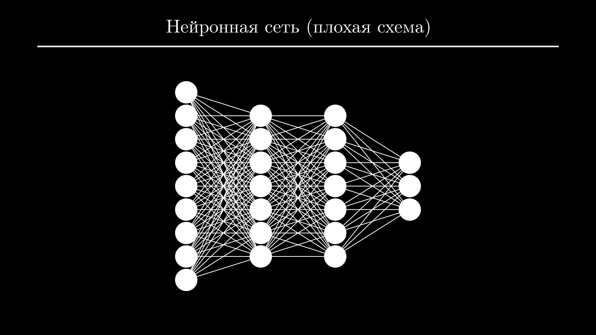

Все потому, что данные и параметры модели здесь показаны в скалярной форме, в то время как нейронные сети совершают операции над матрицами. Поэтому среди Data Scientist-ов про нейроны мало кто говорит, а в книгах и научной литературе обычно используют другую схему, на которую я и предлагаю здесь посмотреть.

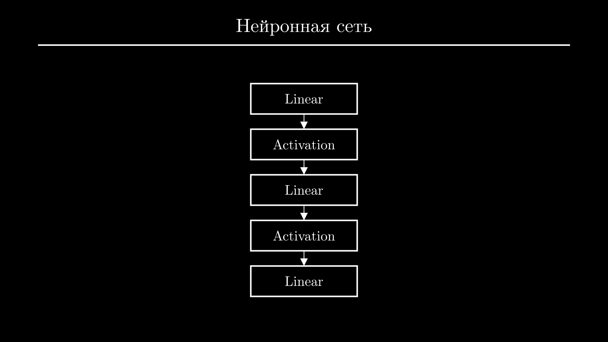

Итак, нейронные сети состоят из чередующихся линейных слоев и функций активации. Первый слой называют хвостом, он получает исходные данные в виде матрицы - ее обычно обозначают как $\mathbf{X}$. В ней строками будут отдельные объекты из выборки, а столбцами - их признаки:

$$
\mathbf{X} = 
\begin{bmatrix}
176 & 76 & 1 \\
185 & 85 & 0 \\
165 & 63 & 0
\end{bmatrix}.
$$

Например, эта матрица содержит данные трех человек. Первая колонка - рост, вторая - вес, третья - отношение к курению. Второй человек имеет рост 185 сантиметров, вес 85 килограмм и не курит.

Последний слой называют головой - он возвращает предсказания модели для каждого входного объекта. Матрицу предсказаний обычно обозначают как $\hat{\mathbf{y}}$, а матрицу истинных значений (или правильных ответов на задачу) - просто $\mathbf{y}$. При обучении модели мы будем сравнивать их друг с другом, чтобы понять, насколько сильно модель ошибается:

$$
\hat{\mathbf{y}} = 
\begin{bmatrix}
0.6 \\ 0.2 \\ 0.5
\end{bmatrix}
\quad
\mathbf{y} =
\begin{bmatrix}
0.5 \\ 1.5 \\ 0.7
\end{bmatrix}.
$$

Здесь предсказания модели для первого и последнего объекта намного ближе к истинным значениям, чем для второго.

Мозгами нейронной сети являются линейные слои, именно в них находятся обучаемые параметры. Нейронная сеть собирается как конструктор: слоев может быть меньше или больше, но если речь идет не о задачах зрения или работы с текстом, обычно используют всего два-три линейных слоя. 

Их основная задача - подсчет промежуточных признаков из линейных комбинаций исходных признаков. Промежуточных признаков, как правило, больше чем исходных, и из них проще получить ответ. 

Например, если мы пытаемся предсказать вероятность инфаркта у пациента, исходными признаками могут быть возраст, вес, пол, отношение к курению, алкоголю, и тип работы - подвижный или сидячий. 

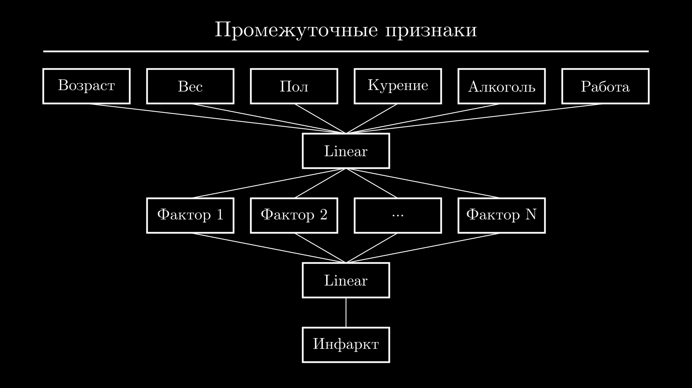

Первый слой нейронной сети может выделить из них промежуточные признаки, похожие на факторы риска. Например, наличие вредных привычек как сумму статусов курения и употребления алкоголя и сидячего образа жизни. Или фактор, связанный с лишним весом как сумму веса и сидячего образа жизни. Аналогично можно выделить другие факторы, связанные с возрастом, сделать поправку на пол пациента и так далее.

Эти признаки будут входными для следующего слоя, который сделает с ними то же самое - составит из них новые комбинации и передаст следующему слою. Или, если это последний слой - посчитает из них ответ. В нашем случае, например, если у пациента обнаружено сразу несколько факторов риска, нейронная сеть могла бы предсказать высокую вероятность инфаркта, иначе - низкую.

Я привел упрощенный пример, в реальности каждый слой подсчитывает, как правило, десятки и сотни промежуточных признаков. И если бы нам приходилось думать, как их выбрать, в нейронных сетях не было бы особого смысла.

Вместо этого мы задаем только количество выходных признаков в каждом слое, а нейронная сеть самостоятельно подбирает наилучшие комбинации исходных признаков для их вычисления. В процессе обучения постепенно формируются такие признаки, которые помогают решить задачу. Чем больше промежуточных признаков и слоев, тем больше будет параметров, и тем более сложные закономерности сможет выучить модель.

Теперь поговорим о том, как именно происходит подсчет признаков. И здесь нам понадобится разобрать операцию умножения матриц. Для примера возьмем матрицу исходных данных. Количество строк в ней соответствует количеству объектов в выборке обучения и для нас оно абсолютно неважно. Важно то, сколько в ней колонок - то есть признаков - и сколько признаков на выходе мы хотим получить. 

Для подсчета каждый линейный слой использует свою матрицу - она называется весами слоя и обозначается как $\mathbf{W}$. Количество строк в ней равно количеству признаков на входе, а количество колонок - количеству признаков на выходе. То есть, если мы хотим из двух признаков получить 3, то у матрицы весов слоя будет 2 строки и 3 колонки.

Изначально она заполнена случайными числами, но в процессе обучения эти числа будут меняться так, чтобы вычислять нужные признаки. В выходной матрице будет столько же строк, сколько и в исходной - то есть количество объектов сохраняется. А колонок будет столько же, сколько выходных признаков.

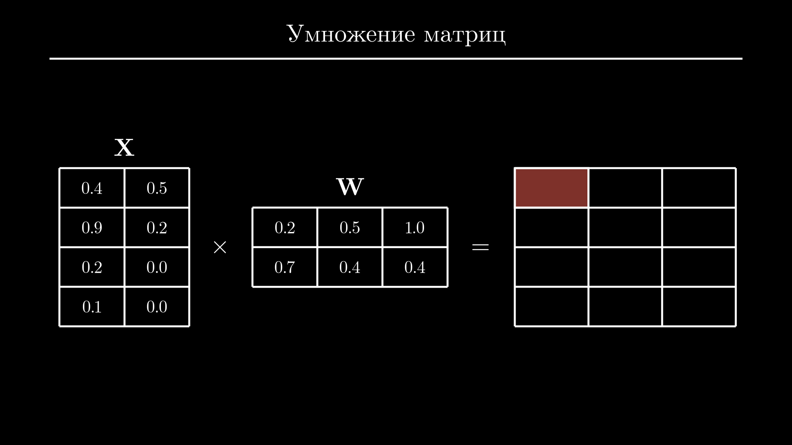

Давайте подумаем, как посчитать элемент в левом верхнем углу. Первое, что приходит в голову - просто умножить те же элементы в каждой из матриц. Но такая операция называется поэлементным умножением, а умножение матриц работает немного по-другому. 

Чтобы вычислить значение в левом верхнем углу, нужно взять каждый элемент из первой строки матрицы слева и умножить его на соответствущий элемент в первом столбце матрицы справа. Значением в левом верхнем углу будет сумма произведений:

$$
0.4 \cdot 0.2 + 0.5 \cdot 0.7 = 0.43.
$$

Для следующего элемента повторяем операции с первой строкой и второй колонкой, первой строкой и третьей колонкой, второй строкой и снова первой колонкой и так далее. Если интересно, можете посчитать результат вручную и сравнить с правильным ответом.

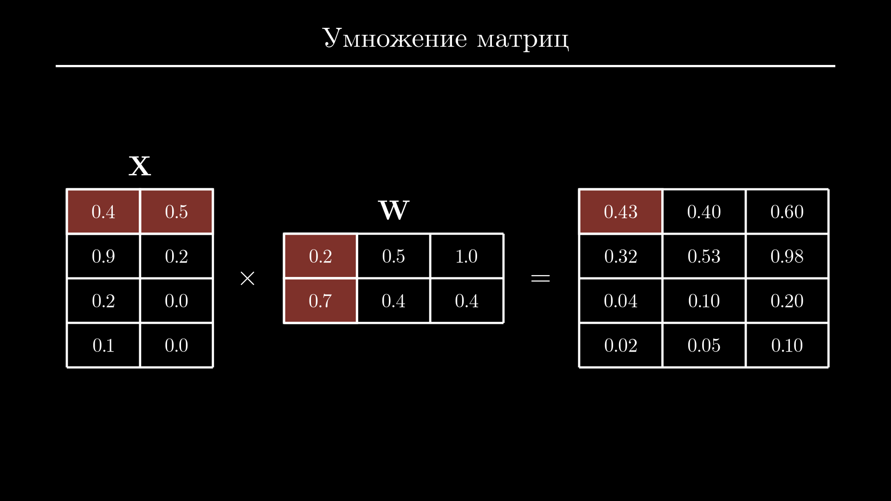

Но я хочу чтобы вы внимательнее посмотрели на сам процесс подсчета новых признаков. В нем всегда участвуют все признаки объекта, но никакие другие объекты в этот подсчет не входят. Получается, что каждый новый признак объекта - это просто взвешенная сумма всех исходных признаков этого объекта. В линейной алгебре это называют линейной комбинацией.

И так как на практике мы естественно будем вычислять все это не руками, предлагаю посмотреть, как линейный слой и умножение матриц выглядят в коде. Сначала установим PyTorch - в терминале выполняем:

```shell
pip3 install torch
```

Если в вашем ПК есть видеокарта от NVidia, то скачается более тяжелая версия PyTorch и установка может занять несколько минут, не пугайтесь.

Давайте сначала повторим пример с умножением двух матриц, который мы только что рассмотрели. Импортируем `torch` и создадим две матрицы - это можно сделать если передать конструктору `tensor` список списков. Внутренние списки будут строками матрицы. Выведем обе матрицы на экран - в PyTorch используется удобное форматирование, так что будет легко проверить, что мы ввели все данные правильно:

```python
import torch

X = torch.tensor([[0.4, 0.5], [0.9, 0.2], [0.2, 0.0], [0.1, 0.0]])
W = torch.tensor([[0.2, 0.5, 1.0], [0.7, 0.4, 0.4]])
print(W)
print(X)
```
```{.text .no-copy}
tensor([[0.2000, 0.5000, 1.0000],
        [0.7000, 0.4000, 0.4000]])
tensor([[0.4000, 0.5000],
        [0.9000, 0.2000],
        [0.2000, 0.0000],
        [0.1000, 0.0000]])
```

Стандартный оператор умножения (`*`) в PyTorch служит для поэлементного умножения. Эта операция закончится ошибкой, потому что для поэлементного умножения размеры матриц должны совпадать:

```python
import torch

X = torch.tensor([[0.4, 0.5], [0.9, 0.2], [0.2, 0.0], [0.1, 0.0]])
W = torch.tensor([[0.2, 0.5, 1.0], [0.7, 0.4, 0.4]])
print(X * W)
```
```{.text .no-copy}
Traceback (most recent call last):
  ...
RuntimeError: The size of tensor a (2) must match
the size of tensor b (3) at non-singleton dimension 1
```

Чтобы вместо этого выполнить умножение по правилам умножения матриц, используем собаку (`@`):

```python
import torch

X = torch.tensor([[0.4, 0.5], [0.9, 0.2], [0.2, 0.0], [0.1, 0.0]])
W = torch.tensor([[0.2, 0.5, 1.0], [0.7, 0.4, 0.4]])
print(X @ W)
```
```{.text .no-copy}
tensor([[0.4300, 0.4000, 0.6000],
        [0.3200, 0.5300, 0.9800],
        [0.0400, 0.1000, 0.2000],
        [0.0200, 0.0500, 0.1000]])
```

Можете сравнить результат с тем, что мы посчитали раньше.

Теперь вместо того, чтобы создавать матрицу весов вручную, создадим линейный слой. Для этого из пакета `torch.nn` импортируем класс `Linear`. Конструктор `Linear` ожидает два аргумента - количество признаков на входе и количество признаков на выходе. В нашем примере было 2 и 3 соответственно. Самое интересное - мы можем легко посмотреть на матрицу весов нового линейного слоя через атрибут `weight`:

```python
import torch
from torch.nn import Linear

X = torch.tensor([[0.4, 0.5], [0.9, 0.2], [0.2, 0.0], [0.1, 0.0]])
layer = Linear(2, 3)
print(layer.weight)
```
```{.text .no-copy}
Parameter containing:
tensor([[ 0.7022,  0.3718],
        [-0.1696,  0.6970],
        [ 0.4542, -0.0430]], requires_grad=True)
```

PyTorch хранит транспонированную матрицу весов, поэтому ее размер $(3 \times 2)$, а не $(2 \times 3)$, как ожидалось. При перезапуске кода ее элементы будут меняться.

Теперь применим линейный слой к матрице `X`. Для этого вызываем объект `layer` с матрицей `X` в качестве аргумента:

```python
import torch
from torch.nn import Linear

X = torch.tensor([[0.4, 0.5], [0.9, 0.2], [0.2, 0.0], [0.1, 0.0]])
layer = Linear(2, 3)
print(layer(X))
```
```{.text .no-copy}
tensor([[-0.0436, -0.2555,  0.2135],
        [-0.0557,  0.1238,  0.2450],
        [-0.0138, -0.0835,  0.4769],
        [-0.0089, -0.1280,  0.4973]], grad_fn=<AddmmBackward0>)
```

В результате получаем матрицу с тем же количеством строк (их было 4) но уже тремя колонками вместо двух.

Советую немного задержаться на этом этапе и попробовать создать матрицы с разным количеством строк и колонок, несколько линейных слоев и применить их к матрицам. 

## Функции активации {#activation}

Вернемся к схеме нейронной сети. Линейные слои мы теперь можем описать более подробно, указав у каждого количество признаков на выходе.

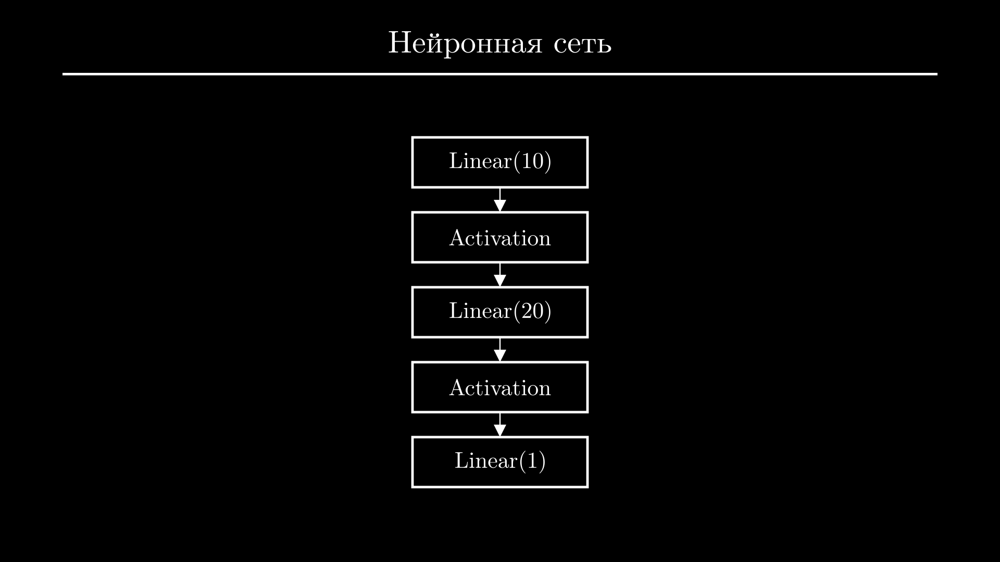

Но кроме линейных слоев есть еще слои активации. Чтобы понять, зачем они нужны, попробуем избавиться от них и записать нейронную сеть в виде формулы. Это несложно - по сути нам нужно просто последовательно умножить матрицу входных данных $\mathbf{Х}$ на матрицы весов каждого слоя:

$$
\hat{\mathbf{y}} = ((\mathbf{X} \mathbf{W}_1) \mathbf{W}_2) \mathbf{W}_3.
$$

Но эту формулу можно упростить, заменив три матрицы их произведением:

$$
\hat{\mathbf{y}} = \mathbf{X} \mathbf{W},
$$

где $\mathbf{W} = \mathbf{W}_1 \mathbf{W}_2 \mathbf{W}_3$.

И нюанс в том, что абсолютно неважно, сколько у нас слоев и сколько в каждом из них промежуточных признаков - матрица $\mathbf{W}$ всегда будет иметь размерность $(n \times 1)$, где $n$ - количество признаков на входе. То есть, по сути, любая нейронная сеть в таком виде будет эквивалентна намного более простой модели - линейной регрессии.

Чтобы исправить эту проблему, между линейными слоями добавляют слои активации. Они, как правило, не содержат никаких параметров и просто применяют одну и ту же функцию к каждому элементу матрицы. Смысл этой операции только в том, чтобы за счет добавления нелинейности предотвратить возможность сокращения формулы.

Вспомните математику в школе или универе - у вас наверняка хоть раз была ситуация, когда формула почти идеально сокращается, но в последний момент какое-нибудь слагаемое все ломает. Здесь идея та же - с учетом функций активации формула нейронной сети изменится, и сократить все матрицы весов до одной уже не получится.

Функции активации должны обладать рядом свойств, которые мы здесь не будем рассматривать. Скажу только, что из-за этого их список ограничен, и на практике вы редко будете задумываться над их выбором. В подавляющем большинстве случаев между линейными слоями используют функцию активации ReLU. Это сокращение от "Rectified Linear Unit" (Улучшенный Линейный Элемент). 

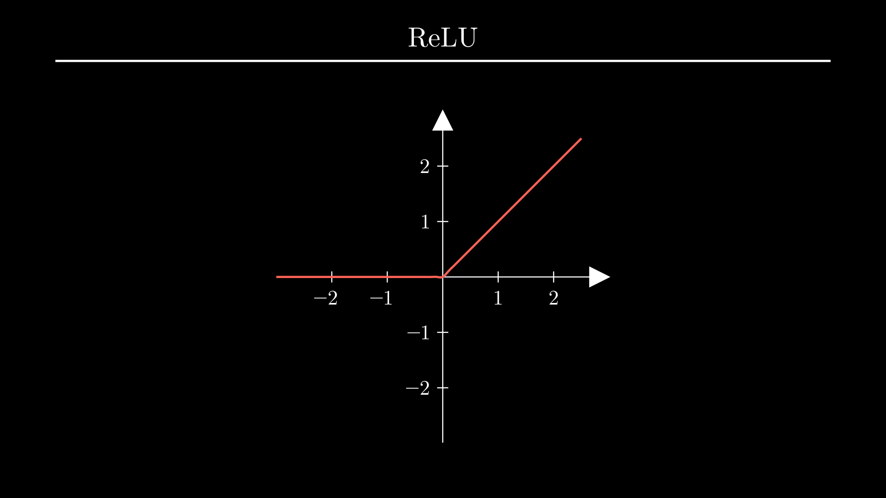

Слева от нуля она равна нулю, а справа совпадает с функцией $у = х$:

$$
\text{ReLU}(x) = \max(0, x).
$$

В результате ее применения к матрице все отрицательные элементы превращаются в нули, а положительные остаются как есть. Да, именно эта простая нелинейная операция по сути заставляет работать все слои нейронной сети вместе.

Кроме стандартного расположения между линейными слоями, в определенных случаях функции активации используются в качестве последнего слоя нейронной сети. Дело в том, что результат линейного слоя никак не ограничен. Если этот слой - последний, модель может давать предсказание в диапазоне от минус до плюс бесконечности. Это подходит для задач регрессии, но есть еще задачи классификации. 

При бинарной классификации модель должна предсказывать число от нуля до единицы, которое будет обозначать уверенность модели в положительном ответе. Например, что человек болен, что операция мошенническая или кредит одобрен. 

Поэтому для таких задач после последнего слоя нейронной сети используют функцию активации Sigmoid. Она задается вот такой хитрой формулой с экспонентой и переводит предсказания из неограниченного диапазона в диапазон от нуля до единицы:

$$
\text{Sigmoid}(x) = \frac{1}{1 + e^{-x}}.
$$

То есть, если исходное предсказание было большим по модулю положительным числом, после слоя активации оно будет близко к единице, если большим по модулю и отрицательным - близко к нулю, а близкие к нулю значения попадут в область неопределенности - около 0.5.

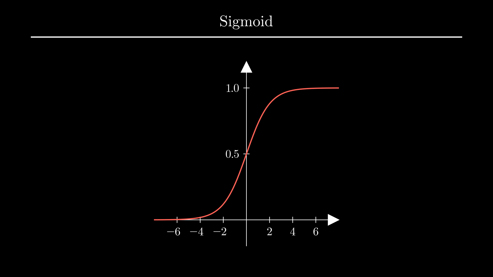

При мультиклассовой классификации предсказания модели нужно отнести к одному из нескольких классов, например, диагностировать конкретную болезнь. Набор классов должен быть полными, а сами классы - взаимоисключающими. Например, ни один человек в выборке не может иметь две болезни сразу, и если он может быть здоров, то состояние "здоров" должно быть отдельным классом. 

В этом случае финальный слой модели настраивают таким образом, чтобы он давал количество предсказаний, равное количеству классов, а ко всем полученным числам применяют функцию активации Softmax. 

Она берет от каждого из чисел экспоненту - это нужно для того, чтобы все числа стали положительными. Дальше все предсказания делятся на их сумму, и финальный результат можно интерпретировать как вероятность принадлежности к одному из классов, а сумма всех вероятностей всегда равна единице:

$$
\text{Softmax}(\mathbf{x}) = \frac{e^{\mathbf{x}}}{\sum{e^{\mathbf{x}}}}.
$$

Вернемся в PyTorch и опробуем слои активации. Импортируем классы `ReLU`, `Sigmoid` и `Softmax` из пакета `torch.nn`. 

Для проверки ReLU создадим матрицу $(3 \times 3)$. Дальше инициализируем объект `ReLU`. Как и остальные слои активации он не требует никаких обязательных аргументов. Теперь применим его к матрице и выведем на экран исходную матрицу и результат:

```python
import torch
from torch.nn import ReLU, Sigmoid, Softmax

X = torch.tensor([[0.4, -0.5, 0.9], [0.3, 0.2, -0.1], [0.1, 0.7, -0.2]])
layer = ReLU()
print(X)
print(layer(X))
```
```{.text .no-copy}
tensor([[ 0.4000, -0.5000,  0.9000],
        [ 0.3000,  0.2000, -0.1000],
        [ 0.1000,  0.7000, -0.2000]])
tensor([[0.4000, 0.0000, 0.9000],
        [0.3000, 0.2000, 0.0000],
        [0.1000, 0.7000, 0.0000]])
```

Как видите, 3 отрицательных числа стали равны нулю, а положительные остались без изменений.

Теперь используем слой `Sigmoid`. Для него создадим матрицу с одной колонкой:

```python
import torch
from torch.nn import ReLU, Sigmoid, Softmax

X = torch.tensor([[6.7], [-3.2], [1.1]])
layer = Sigmoid()
print(X)
print(layer(X))
```
```{.text .no-copy}
tensor([[ 6.7000],
        [-3.2000],
        [ 1.1000]])
tensor([[0.9988],
        [0.0392],
        [0.7503]])
```

После применения `Sigmoid` первое значение 6.7 превратилось практически в 100% уверенность, второе - примерно в 4%, а третье - в 75%.

Работу `Softmax` я покажу на той же матрице, которую мы использовали для ReLU:

```python
import torch
from torch.nn import ReLU, Sigmoid, Softmax

X = torch.tensor([[0.4, -0.5, 0.9], [0.3, 0.2, -0.1], [0.1, 0.7, -0.2]])
layer = Softmax()
print(X)
print(layer(X))
```
```{.text .no-copy}
tensor([[ 0.4000, -0.5000,  0.9000],
        [ 0.3000,  0.2000, -0.1000],
        [ 0.1000,  0.7000, -0.2000]])
tensor([[0.3273, 0.1331, 0.5396],
        [0.3883, 0.3514, 0.2603],
        [0.2807, 0.5114, 0.2079]])
```

В каждой строке побеждает то значение, которое изначально было максимальным, но после Softmax результаты прочитать намного проще. В первой строке значение справа победило с большим перевесом почти в 54%, во второй ситуация менее однозначная - тут победило значение слева. В третьей строке победило значение по центру, снова со значительным отрывом.

## Собираем нейросеть {#model}

Теперь мы знаем все, чтобы создать нейронную сеть для любой задачи. 

Для того чтобы объединить слои в PyTorch есть класс `Sequential`. Импортируем его из пакета `torch.nn`. Присвоим нейронную сеть переменной - обычно ее называют `model`. Передадим конструктору `Sequential` последовательность слоев:

```python
import torch
from torch.nn import Linear, ReLU, Sequential

X = torch.tensor([[0.4, -0.5, 0.9], [0.3, 0.2, -0.1], [0.1, 0.7, -0.2]])
model = Sequential(...)
```

Предположим, что матрица `X` содержит входные данные, тогда признаков на входе будет 3. Отобразим их в 10, добавим функцию активации, затем пересчитаем 10 признаков в 20, снова функция активации и последний слой - 20 признаков в ответ. В таком виде это модель для регрессии, для классификации можно добавить слои `Sigmoid` или `Softmax` и при необходимости изменить количество признаков в последнем слое. Чтобы получить предсказания модели, достаточно вызвать ее с матрицей входных данных - так же как мы это делали со слоями по отдельности:

```python
import torch
from torch.nn import Linear, ReLU, Sequential

X = torch.tensor([[0.4, -0.5, 0.9], [0.3, 0.2, -0.1], [0.1, 0.7, -0.2]])
model = Sequential(
    Linear(3, 10),
    ReLU(),
    Linear(10, 20),
    ReLU(),
    Linear(20, 1),
)
print(model(X))
```
```{.text .no-copy}
tensor([[-0.1277],
        [-0.0324],
        [-0.0028]], grad_fn=<AddmmBackward0>)
```

Результатом в нашем случае будет матрица $(3 \times 1)$.

Теперь осталось только обучить модель, но перед этим советую вам создать еще несколько моделей, чтобы проверить себя и убедиться, что вы научились читать схемы. Попробуйте создать вот эти 3 модели, а решение найдете в файле [:material-file: models.py](../static/posts/nn/models.py){:download=models.py}.

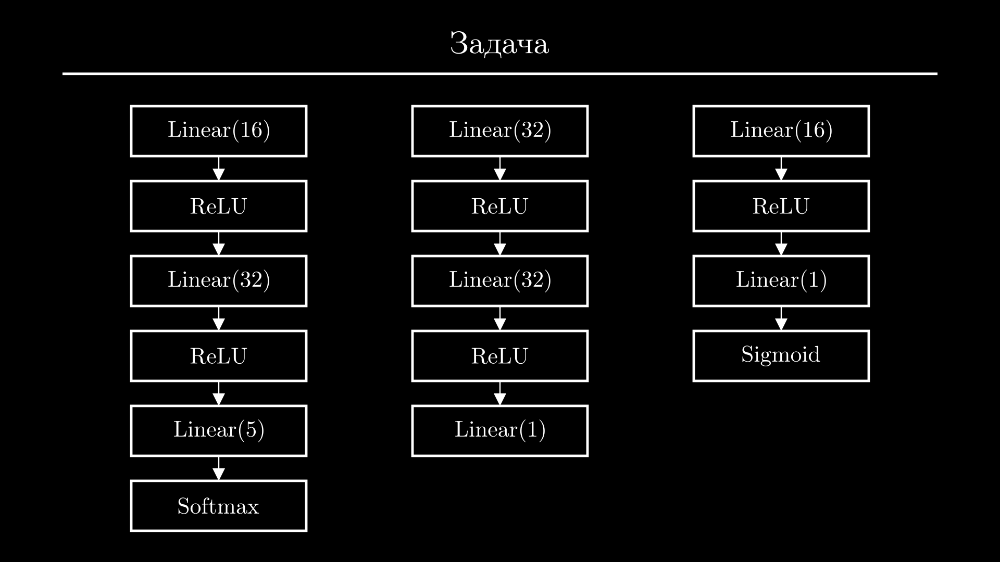

## Функции потерь {#loss}

Итак, сейчас проблема в том, что каждый линейный слой модели инициализирован случайными параметрами, и предсказания модели тоже являются случайными числами. Задача состоит в том, чтобы подобрать такие параметры модели, при которых ее предсказания будут как можно ближе к правильным значениям. Этот процесс называется обучением модели. Тогда модель можно будет использовать для решения новых задач. 

Но сначала нам нужно четко сформулировать, что именно мы считаем хорошей моделью. Для этого нужно охарактеризовать отклонения модели от желаемого результата на всей выборке обучения одним числом. Чем оно меньше, тем лучше модель. И в этом нам снова помогут особые функции, которые называют функциями потерь, и выбор конкретной функции зависит от задачи.

Самая простая функция потерь у задач регрессии. Ее называют средний квадрат отклонения, Mean Squared Error или MSE. Для ее вычисления находят разность между предсказаниями модели $\hat{\mathbf{y}}$ и истинными значениями $\mathbf{y}$, возводят разность в квадрат, чтобы избавиться от знака и увеличить штраф за сильные отклонения, и находят среднее:

$$
\mathcal{L}(\hat{\mathbf{y}}, \mathbf{y}) = \frac{1}{m} \sum_{i=1}^m (\mathbf{y}_i - \hat{\mathbf{y}}_i)^2.
$$

Здесь $m$ - это размер выборки. Можете посчитать отклонение для этих значений и сверить результат:

$$
\hat{\mathbf{y}} = 
\begin{bmatrix}
0.6 \\ 0.2 \\ 0.5
\end{bmatrix}
\quad
\mathbf{y} =
\begin{bmatrix}
0.5 \\ 1.5 \\ 0.7
\end{bmatrix}
\quad
\mathcal{L}(\hat{\mathbf{y}}, \mathbf{y}) = 0.58.
$$

Для задач бинарной классификации используют другую функцию потерь - бинарную кросс-энтропию. Для штрафа здесь используется логарифмическая зависимость:

$$
\mathcal{L}(\hat{\mathbf{y}}, \mathbf{y}) = -\mathbf{y}_i \log(\hat{\mathbf{y}}_i).
$$

Чтобы понять почему, построим график минус логарифма. Так как предсказания моделей классификации всегда находятся в диапазоне $[0;1]$, на графике обращаем внимание только на этот участок. Теперь из формулы и графика видно, что если истинное значение равно единице, а предсказание модели близко к единице, то штраф будет близок к нулю. Но если модель колеблется или с уверенностью предсказывает 0, штраф будет резко увеличиваться.

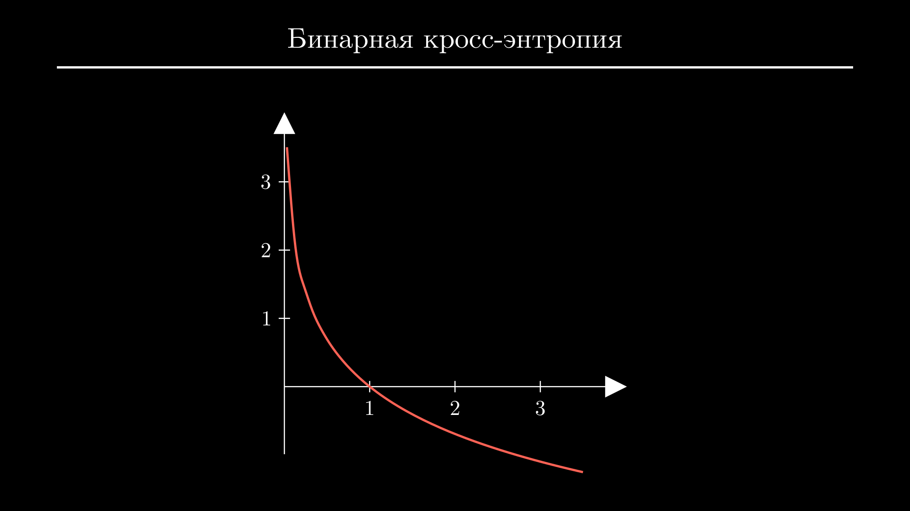

Чтобы учесть случаи, когда истинное значение равно нулю, добавляют второе слагаемое. Здесь аргумент логарифма изменен таким образом, чтобы наоборот, штрафовать модель за значения, близкие к единице:

$$
\mathcal{L}(\hat{\mathbf{y}}, \mathbf{y}) = -\mathbf{y}_i \log(\hat{\mathbf{y}}_i) - (1 - \mathbf{y}_i) \log(\mathbf{1 -\hat{y}}_i).
$$

Так как истинное значение всегда равно либо нулю, либо единице, в каждом случае работает только одно из слагаемых, второе обращается в 0. Не забываем, что нам нужно усреднить значения функции потерь по всей выборке - с учетом этого финальная формула выглядит вот так:

$$
\mathcal{L}(\hat{\mathbf{y}}, \mathbf{y}) = -\frac{1}{m}\sum_{i=1}^{m}\mathbf{y}_i \log(\hat{\mathbf{y}}_i) + (1 - \mathbf{y}_i) \log(\mathbf{1 -\hat{y}}_i).
$$

Тут можете снова посчитать значение функции потерь вручную для двух матриц и сверить результат:

$$
\hat{\mathbf{y}} = 
\begin{bmatrix}
0.9 \\ 0.3 \\ 0.2
\end{bmatrix}
\quad
\mathbf{y} =
\begin{bmatrix}
1 \\ 1 \\ 0
\end{bmatrix}
\quad
\mathcal{L}(\hat{\mathbf{y}}, \mathbf{y}) = 0.51.
$$

Формулу бинарной кросс-энтропии можно обобщить на случай $K$ классов:

$$
\mathcal{L}(\hat{\mathbf{y}}, \mathbf{y}) = -\frac{1}{m}\sum_{i=1}^{m}\sum_{k=1}^{K}\mathbf{y}_{i,k} \log(\hat{\mathbf{y}}_{i,k}).
$$

Ее называют категориальной кросс-энтропией и используют для задач мультиклассовой классификации. Так как тут все по сути аналогично предыдущему случаю и вам все равно не придется считать ее вручную, более подробно ее разбирать не будем. 

Вместо этого предлагаю вернуться к коду и посмотреть, как функции потерь вычисляются в PyTorch. Для каждой из перечисленных функций есть свои классы в пакете `torch.nn`, из которого мы импортировали слои и функции активации. Импортируем классы `MSELoss`, `BCELoss` - это сокращение от binary cross-entropy - и `CrossEntropyLoss` - это категориальная кросс-энтропия. И повторим примеры, которые мы решали вручную.

Начнем со среднего квадрата отклонения. Код здесь будет выглядеть аналогично - создаем новый объект для функции потерь, матрицы истинных значений и предсказаний модели, и передаем их функции потерь через вызов: 

```python
import torch
from torch.nn import MSELoss, BCELoss, CrossEntropyLoss

loss_fn = MSELoss()
y = torch.tensor([[0.5], [1.5], [0.7]])
y_hat = torch.tensor([[0.6], [0.2], [0.5]])
print(loss_fn(y_hat, y))
```
```{.text .no-copy}
tensor(0.5800)
```

Тут важный момент - предсказания модели всегда должны быть первым аргументом, а истинные значения - вторым. На вычисление MSE порядок не влияет, но остальные функции потерь будут к нему чувствительны. Полученный результат можно сравнить с тем, что мы вычислили вручную - они должны совпадать.

Аналогично посчитаем бинарную кросс-энтропию. Здесь используем те же матрицы, по которым мы считали ее вручную:

```python
import torch
from torch.nn import MSELoss, BCELoss, CrossEntropyLoss

loss_fn = BCELoss()
y = torch.tensor([[1.0], [1.0], [0.0]])
y_hat = torch.tensor([[0.9], [0.3], [0.2]])
print(loss_fn(y_hat, y))
```
```{.text .no-copy}
tensor(0.5108)
```

А вот категориальная кросс-энтропия в PyTorch реализована очень необычно. Вместо матрицы истинных значений нужно использовать вектор - внутренние списки мы убираем и передаем конструктору `tensor` плоский список целых чисел. Во-вторых, несмотря на то, что у моделей для мультиклассовой классификации последним слоем всегда должен быть `Softmax`, здесь ожидается, что последний слой - линейный, а функцию softmax функция потерь применяет внутри.

```python
import torch
from torch.nn import MSELoss, BCELoss, CrossEntropyLoss

loss_fn = CrossEntropyLoss()
y = torch.tensor([1, 2, 0])
y_hat = torch.tensor([[-1.2, 2.2, 0.2], [2.3, 0.2, 0.7], [0.9, -2.2, -1.2]])
print(loss_fn(y_hat, y))
```
```{.text .no-copy}
tensor(0.7306)
```

Честно говоря, мне непонятно зачем так сделано, но при обучении модели я еще заострю на этом внимание.

## Метрики {#metrics}

Сейчас вы могли заметить другую проблему с функциями потерь - их значения очень плохо воспринимаются. Да, есть однозначная закономерность - их минимальное значение всегда равно нулю, и чем ближе оно к нулю, тем лучше модель. Но по конкретному значению $0.73$ абсолютно невозможно догадаться о том, что модель по сути верно угадала классы двух объектов из трех, и в одном ошиблась. 

Поэтому для финальной оценки качества модели используют другие функции, их называют метриками. Хорошая новость в том, что они не должны обладать никакими особыми свойствами кроме читаемости и доступности для понимания. Кроме того, их формулы намного проще и многим уже знакомы.

Чаще всего для задач регрессии в качестве метрики используют средний процент отклонения, а для задач классификации - точность предсказаний модели. Есть и более специфические метрики, которые могут быть важны для определенных сценариев или задач, но сейчас предлагаю остановиться только на этих. 

К сожалению, для вычисления метрик в PyTorch нет специальных классов. Но вы можете установить библиотеку `torchmetrics` или посчитать их вручную.

Например, чтобы получить средний процент отклонения, нужно вычислить модуль разности предсказаний модели и истинных значений, разделить его на истинные значения, умножить на 100 и усреднить. Будьте аккуратны, если среди реальных значений есть нули - результатом будет очень большое число или неопределенность.

```python
import torch

y = torch.tensor([[0.5], [1.5], [0.7]])
y_hat = torch.tensor([[0.6], [0.2], [0.5]])
score = (y - y_hat).abs() / y * 100
print(score.mean())
```
```{.text .no-copy}
tensor(45.0794)
```

Точность предсказаний модели для бинарной классификации можно посчитать если округлить предсказания модели, сравнить их с реальными значениями через знак логического сравнения, усреднить результат и умножить его на 100. Мы получим процент объектов, которые модель верно классифицировала:

```python
import torch

y = torch.tensor([[1.0], [1.0], [0.0]])
y_hat = torch.tensor([[0.9], [0.3], [0.2]])
score = (y_hat.round() == y).sum() / len(y) * 100
print(score)
```
```{.text .no-copy}
tensor(66.6667)
```

В случае мультиклассовой классификации вдоль колонок нужно будет применить функцию `argmax` - для каждой строки она возвращает номер колонки, в которой находится наибольшее значение. Результат затем также сравниваем с истинными значениями, усредняем и умножаем на 100:

```python
import torch

y = torch.tensor([1, 2, 0])
y_hat = torch.tensor([
    [-1.2, 2.2, 0.2],
    [2.3, 0.2, 0.7],
    [0.9, -2.2, -1.2]
])
score = (y_hat.argmax(1) == y).sum() / len(y) * 100
print(score)
```
```{.text .no-copy}
tensor(66.6667)
```

В таком виде результаты читаются намного проще - сразу видно на сколько процентов наша модель отклоняется в предсказаниях непрерывных величин или какой процент объектов верно классифицирует.

## Градиентный спуск {#descent}

Итак, для каждой задачи мы подобрали свою функцию потерь, значение которой зависит от исходных данных и параметров модели. Осталось найти оптимальные параметры модели, которые позволят достичь минимально возможного значения функции потерь:

$$
\mathbf{W}^* = \arg \min_{\mathbf{W}} \mathcal{L}(\mathbf{X}, \mathbf{y}; \mathbf{W}).
$$

То есть по сути все сводится к поиску минимума функции, и вы можете сразу же предложить алгоритм поиска минимума из школы. Нужно найти производную функции - так как данные $\mathbf{X}$ и $\mathbf{y}$ по сути константы, это будет производная по параметрам модели - приравнять ее к нулю и решить полученное уравнение. Одним из корней этого уравнения и будет точка, в которой достигается наименьшее значение функции потерь:

$$
\frac{\partial \mathcal{L}}{\partial \mathbf{W}} = 0.
$$

Но к сожалению, воспользоваться этим методом здесь не удастся. За обозначением $\mathbf{W}$ скрывается не число, а несколько матриц весов линейных слоев модели. При таком раскладе мы получим систему уравнений, у которой не будет аналитического решения, а численные решения будут иметь слишком высокую сложность.

Но есть другой алгоритм с похожей идеей. Он позволяет прийти в точку, где производная равна нулю из любой произвольной точки. Этот алгоритм называют градиентным спуском. У него много нюансов и он не гарантирует успех, но зато его сложность намного ниже. Поэтому на практике пользуются именно им или его модифицированным вариантом. 

Чтобы понять, как работает градиентный спуск, изобразим задачу графически. Предположим, что у нашей модели всего один параметр - я буду откладывать его значения по оси $х$, а величину функции потерь - по оси $у$. Теперь мы можем выбрать какое-нибудь значение параметра наугад и вычислить величину функции потерь модели с этим значением параметра.

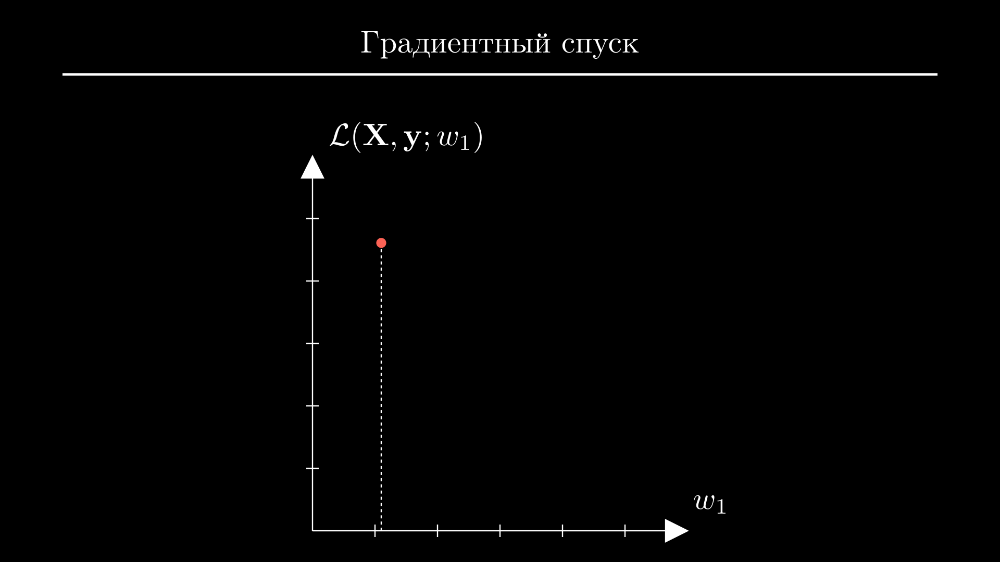

Идея градиентного спуска в том, чтобы из этой точки прийти в точку минимума функции, делая небольшие шаги. Для простоты зафиксируем ширину шага. Обозначим его как $\alpha$ и приравняем $0.3$. Теперь остается только сделать выбор - идти из точки влево или вправо? И определиться нам поможет производная. Точнее, даже не сама производная, а ее знак. 

Если производная больше нуля, это значит, что с увеличением аргумента значение функции тоже увеличивается. И если мы шагнем вправо, то почти гарантированно окажемся в точке, где значение функции больше, чем в исходной:

$$
\frac{\partial \mathcal{L}}{\partial w_1} > 0 \rightarrow \mathcal{L}(w_1 + \alpha) > \mathcal{L}(w_1).
$$

Нам это не подходит, поэтому в этом случае нужно делать шаг влево. А если производная меньше нуля, значит функция уменьшается с увеличением аргумента, и нужно делать шаг вправо:

$$
\frac{\partial \mathcal{L}}{\partial w_1} < 0 \rightarrow \mathcal{L}(w_1 + \alpha) < \mathcal{L}(w_1).
$$

Все случаи можно обобщить вот такой формулой:

$$
w_1 \leftarrow w_1 - \alpha\ \text{sign} \left( \frac{\partial \mathcal{L}}{\partial w_1} \right).
$$

То есть, всегда нужно делать фиксированный шаг против знака производной. Как только мы попадем в новую точку, все действия повторяются, и так до тех пор, пока мы не начнем колебаться вокруг конечной точки. Эта точка и будет минимумом функции.

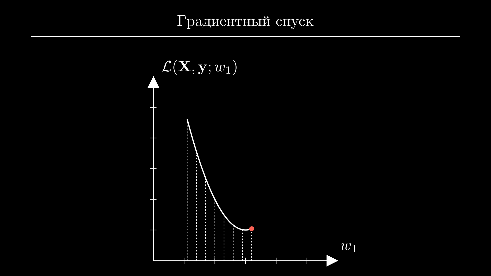

Сейчас заметно, что шаги стоило делать немного эффективнее. Там, где модуль производной достаточно большой и функция быстро уходит вниз, можно делать более широкие шаги - так, чтобы подойти к минимуму за меньше количество итераций. А ближе к точке минимума, где производная близка к нулю, наоборот, стоило бы замедлиться, чтобы оказаться ближе к минимуму.

То есть, вместо использования только знака производной нужно использовать само значение производной и немного изменить множитель. Переписав формулу в таком виде, мы и получим алгоритм градиентного спуска:

$$
w_1 \leftarrow w_1 - \alpha\ \frac{\partial \mathcal{L}}{\partial w_1}.
$$

Коэффициент $\alpha=10^{-4} \dots 10^{-2}$ называется степенью обучения или learning rate.

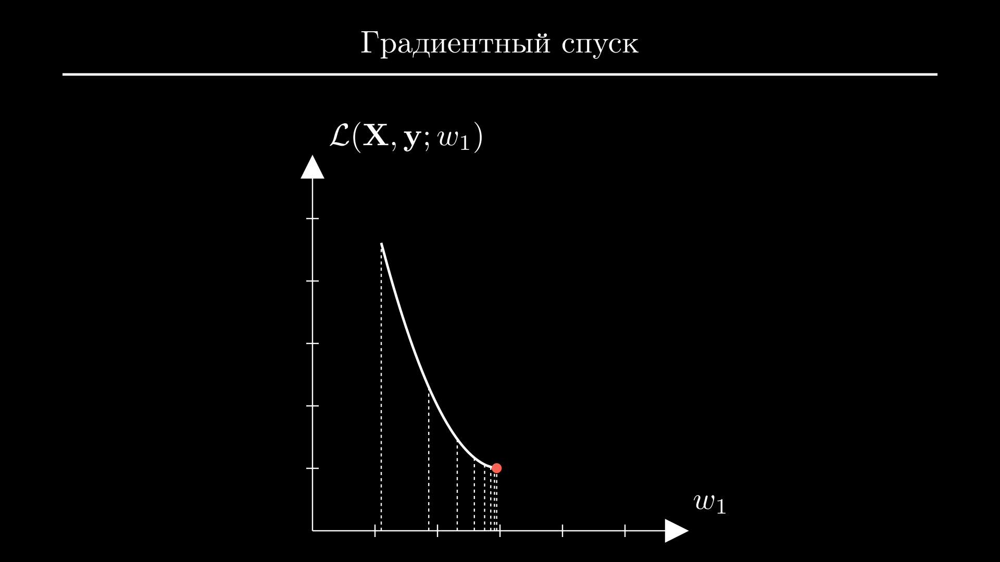

Хорошо, теперь вы можете спросить - а как быть с моделью, у которой не один параметр? И причем тут слово "градиент"? Дело в том, что градиент - это обобщение понятия производной для функции нескольких переменных. Градиент функции потерь по параметрам модели $\mathbf{W} = \{\mathbf{W}_1,\mathbf{W}_2,\dots,\mathbf{W}_n\}$ будет состоять из частных производных по каждому параметру:

$$
\nabla_{\mathbf{W}} \mathcal{L} 
= 
\left(
\frac{\partial \mathcal{L}}{\partial \mathbf{W}_1},\,
\frac{\partial \mathcal{L}}{\partial \mathbf{W}_2},\,
\dots,\,
\frac{\partial \mathcal{L}}{\partial \mathbf{W}_n}
\right)
$$

Их значения будут использованы для того, чтобы обновить параметры модели по отдельности, точно таким же образом, как мы это делали в случае только одного параметра:

$$
\mathbf{W}_i \leftarrow \mathbf{W}_i - \alpha \frac{\partial \mathcal{L}}{\partial \mathbf{W}_i}.
$$

С градиентным спуском связаны и другие сложности. Например, само по себе вычисление частных производных функции потерь по параметрам произвольной нейронной сети является настолько сложной задачей, что у алгоритма для их вычисления есть отдельное название - алгоритм обратного распространения ошибки. 

Кроме того, у градиентного спуска есть свои недостатки, которые попытались исправить в его модифицированных версиях - ускоренном градиентном спуске Нестерова, AdaGrad, RMSProp и Adam. 

Но несмотря на это, хорошая новость в том, что этот алгоритм займет в вашем коде всего три строчки. На этом моменте предлагаю перейти к заключительной части практики и обучить модель.

## Обучаем нейросеть {#train}

Для обучения используем довольно популярный игрушечный набор данных *iris*. Задача заключается в том, чтобы по параметрам цветка определить, к какому из трех сортов ириса он относится. То есть, это задача мультиклассовой классификации.


Параметров всего 4 - длина и ширина чашелистика (sepal) и длина и ширина лепестка (petal). Если хотите писать код вместе со мной, скачайте файлы [:material-file: data.pt](../static/posts/nn/data.pt){:download=data.pt} и [:material-file: target.pt](../static/posts/nn/target.pt){:download=target.pt} и положите в папку c проектом.

Для начала загрузим данные с помощью функции `torch.load` и посмотрим на матрицы признаков и истинных значений. Из каждой возьмем первые 3 строчки:

```python
import torch

X = torch.load("data.pt")
y = torch.load("target.pt")
print(X[:3])
print(y[:3])
```
```{.text .no-copy}
tensor([[7.4000, 2.8000, 6.1000, 1.9000],
        [6.7000, 3.1000, 5.6000, 2.4000],
        [6.0000, 3.4000, 4.5000, 1.6000]])
tensor([2, 2, 1])
```

Как я и говорил, с каждым цветком связано 4 признака, а классы ирисов закодированы числами 0 (*setósa*), 1 (*versicolor*) и 2 (*virginica*).

Разобьем набор данных на выборку обучения и валидации. Всего у нас 150 объектов, поэтому предлагаю взять 100 для обучения и оставшиеся 50 для валидации. Обычно перед этим строки нужно перемешать, но у меня они уже перемешаны, поэтому просто делим матрицы с помощью срезов:

```python hl_lines="5 6"
import torch

X = torch.load("data.pt")
y = torch.load("target.pt")
X_train, X_val = X[:100], X[100:]
y_train, y_val = y[:100], y[100:]
```

Теперь создадим модель и инициализируем объект для подсчета функции потерь. Импортируем все необходимое из пакета `torch.nn` - класс `Sequential`, слои `Linear` и `ReLU` и функцию потерь `CrossEntropyLoss`. Создадим нейронную сеть из двух линейных слоев - первый отображает 4 признака в 16, дальше функция активации ReLU и финальный слой - 16 признаков в 3 класса. Как мы помним, слой `Softmax` здесь не нужен - эту функцию применит объект `CrossEntropyLoss`. Попробуем посчитать предсказание модели и величину функции потерь:

```python hl_lines="9 10 11 12"
import torch
from torch.nn import Sequential, Linear, ReLU, CrossEntropyLoss

X = torch.load("data.pt")
y = torch.load("target.pt")
X_train, X_val = X[:100], X[100:]
y_train, y_val = y[:100], y[100:]

model = Sequential(Linear(4, 16), ReLU(), Linear(16, 3))
loss_fn = CrossEntropyLoss()
y_hat = model(X_train)
loss = loss_fn(y_hat, y_train)
```

Ее значение сейчас неважно, важно что оно в принципе посчиталось. Это значит, что мы все делаем правильно.

Осталось реализовать градиентный спуск. Чтобы вычислить частные производные функции потерь по параметрам модели - то есть, градиент - достаточно вызвать метод `backward` объекта `loss`. Выводим его на экран:

```python hl_lines="13 14"
import torch
from torch.nn import Sequential, Linear, ReLU, CrossEntropyLoss

X = torch.load("data.pt")
y = torch.load("target.pt")
X_train, X_val = X[:100], X[100:]
y_train, y_val = y[:100], y[100:]

model = Sequential(Linear(4, 16), ReLU(), Linear(16, 3))
loss_fn = CrossEntropyLoss()
y_hat = model(X_train)
loss = loss_fn(y_hat, y_train)
gradient = loss.backward()
print(gradient)
```
```{.text .no-copy}
None
```

По какой-то причине градиент равен `None`. На самом деле мы все сделали правильно, просто в PyTorch используется немного другой подход. Вместо явного возврата производных, они записываются прямо в те матрицы, которые использовались в вычислениях. В нашем случае, это веса модели. 

Если вы помните, мы уже подсматривали матрицу весов линейного слоя, предлагаю сделать это еще раз. Но перед этим я временно уменьшу количество промежуточных признаков до 3, чтобы матрица весов была более компактной. Дальше достаточно обратиться к первому слою модели через индекс и вывести его атрибут `weight`:

```python hl_lines="9 14"
import torch
from torch.nn import Sequential, Linear, ReLU, CrossEntropyLoss

X = torch.load("data.pt")
y = torch.load("target.pt")
X_train, X_val = X[:100], X[100:]
y_train, y_val = y[:100], y[100:]

model = Sequential(Linear(4, 3), ReLU(), Linear(3, 3))
loss_fn = CrossEntropyLoss()
y_hat = model(X_train)
loss = loss_fn(y_hat, y_train)
gradient = loss.backward()
print(model[0].weight)
```
```{.text .no-copy}
Parameter containing:
tensor([[-0.4149,  0.0777, -0.0624, -0.0095],
        [-0.0500,  0.1675, -0.4424, -0.4024],
        [-0.2891,  0.3666, -0.2081, -0.1682]], requires_grad=True)
```

Так вот, у этой матрицы есть атрибут `grad`. Если я закомментирую вызов `backward`, он будет равен `None`:

```python hl_lines="13 14"
import torch
from torch.nn import Sequential, Linear, ReLU, CrossEntropyLoss

X = torch.load("data.pt")
y = torch.load("target.pt")
X_train, X_val = X[:100], X[100:]
y_train, y_val = y[:100], y[100:]

model = Sequential(Linear(4, 3), ReLU(), Linear(3, 3))
loss_fn = CrossEntropyLoss()
y_hat = model(X_train)
loss = loss_fn(y_hat, y_train)
# gradient = loss.backward()
print(model[0].weight.grad)
```
```{.text .no-copy}
None
```

Но после вызова `backward`, в этот атрибут запишется матрица того же размера. Здесь в каждой ячейке находится частная производная по соответствующему параметру этого слоя:

```python hl_lines="13"
import torch
from torch.nn import Sequential, Linear, ReLU, CrossEntropyLoss

X = torch.load("data.pt")
y = torch.load("target.pt")
X_train, X_val = X[:100], X[100:]
y_train, y_val = y[:100], y[100:]

model = Sequential(Linear(4, 3), ReLU(), Linear(3, 3))
loss_fn = CrossEntropyLoss()
y_hat = model(X_train)
loss = loss_fn(y_hat, y_train)
gradient = loss.backward()
print(model[0].weight.grad)
```
```{.text .no-copy}
tensor([[ 0.0000,  0.0000,  0.0000,  0.0000],
        [-0.0331,  0.0329, -0.1126, -0.0422],
        [ 0.0000,  0.0000,  0.0000,  0.0000]])
```

Теперь, следуя алгоритму градиентного спуска, нам остается только вычесть из матрицы весов каждого линейного слоя значения частных производных, умноженные на небольшое число. К сожалению, из-за некоторых тонкостей, которые я сейчас не буду объяснять, эта операция закончится ошибкой:

```python hl_lines="15 16 17"
import torch
from torch.nn import Sequential, Linear, ReLU, CrossEntropyLoss

X = torch.load("data.pt")
y = torch.load("target.pt")
X_train, X_val = X[:100], X[100:]
y_train, y_val = y[:100], y[100:]

model = Sequential(Linear(4, 3), ReLU(), Linear(3, 3))
loss_fn = CrossEntropyLoss()
y_hat = model(X_train)
loss = loss_fn(y_hat, y_train)
loss.backward()

alpha = 0.01
model[0].weight -= alpha * model[0].weight.grad
model[2].weight -= alpha * model[2].weight.grad
```
```{.text .no-copy}
Traceback (most recent call last):
  File "<input>", line 16, in <module>
RuntimeError: a leaf Variable that requires grad 
is being used in an in-place operation.
```

Дело в том, что в PyTorch и не предполагается, что вы будете делать эти шаги вручную. Для этих целей есть специальный объект - оптимизатор. Импортируем оптимизатор `SGD` - это сокращение от Stochastic Gradient Descent - из пакета `torch.optim`. Конструктор `SGD` ожидает ссылку на веса модели, которыми он будет управлять, и величину коэффициента обучения. Для того чтобы сделать шаг градиентного спуска, нам все еще нужно вычислить производные с помощью метода `backward`. Но вот для обновления весов достаточно будет просто вызвать метод `step` - он сделает то же, что мы прописали вручную, но автоматически и для всех слоев модели, у которых есть параметры. 

```python hl_lines="3 16 17"
import torch
from torch.nn import Sequential, Linear, ReLU, CrossEntropyLoss
from torch.optim import SGD

X = torch.load("data.pt")
y = torch.load("target.pt")
X_train, X_val = X[:100], X[100:]
y_train, y_val = y[:100], y[100:]

model = Sequential(Linear(4, 3), ReLU(), Linear(3, 3))
loss_fn = CrossEntropyLoss()

y_hat = model(X_train)
loss = loss_fn(y_hat, y_train)
loss.backward()
optimizer = SGD(model.parameters(), lr=0.01)
optimizer.step()
```

В таком виде код работает, но невозможно понять, произошло что-то на самом деле или нет.

Как мы помним, даже после одного шага градиентного спуска значение функции потерь на выборке обучения должно стать меньше. Поэтому выведем значение до вызова метода `step` и посчитаем его заново после вызова:

```python hl_lines="16 19"
import torch
from torch.nn import Sequential, Linear, ReLU, CrossEntropyLoss
from torch.optim import SGD

X = torch.load("data.pt")
y = torch.load("target.pt")
X_train, X_val = X[:100], X[100:]
y_train, y_val = y[:100], y[100:]

model = Sequential(Linear(4, 3), ReLU(), Linear(3, 3))
loss_fn = CrossEntropyLoss()

y_hat = model(X_train)
loss = loss_fn(y_hat, y_train)
loss.backward()
print(loss)
optimizer = SGD(model.parameters(), lr=0.01)
optimizer.step()
print(loss_fn(model(X_train), y_train))
```
```{.text .no-copy}
tensor(1.1588, grad_fn=<NllLossBackward0>)
tensor(1.1578, grad_fn=<NllLossBackward0>)
```

Конкретные числа у вас и у меня будут разными, потому что они зависят от случайной инициализации модели, но после шага оптимизации значение функции потерь должно быть меньше.

Теперь осталось сделать достаточно много таких шагов и надеяться, что мы придем в точку минимума. Я верну 16 промежуточных признаков на место и сделаю цикл из 100 итераций. На практике поступают чуть умнее, но об этом поговорим как-нибудь в следующий раз. 

На самом деле, есть еще один важный момент - каждый новый вызов метода `backward` не заменяет производные, а суммирует их значения с предыдущими. Некоторые стратегии обучения это грамотно обыгрывают, но в нашем случае суммирование производных приведет к катастрофе. Поэтому первой или последней строчкой в цикле вызываем метод оптимизатора `zero_grad` - он обнулит все производные - то есть по сути сотрет память модели о предыдущих итерациях. В конце можно вывести значение функции потерь для проверки:

```python hl_lines="10 14 15 16 17 18 19 20"
import torch
from torch.nn import Sequential, Linear, ReLU, CrossEntropyLoss
from torch.optim import SGD

X = torch.load("data.pt")
y = torch.load("target.pt")
X_train, X_val = X[:100], X[100:]
y_train, y_val = y[:100], y[100:]

model = Sequential(Linear(4, 16), ReLU(), Linear(16, 3))
loss_fn = CrossEntropyLoss()
optimizer = SGD(model.parameters(), lr=0.01)

for _ in range(500):
    y_hat = model(X_train)
    loss = loss_fn(y_hat, y_train)
    loss.backward()
    optimizer.step()
    optimizer.zero_grad()
    print(f"{loss:.3f}")
```
```{.text .no-copy}
1.414
1.356
...
0.347
0.347
```

Запускаем код и видим, что значение функции потерь стабильно падает.

Это очень хороший знак, но конкретные значения функции потерь нам все еще ни о чем не говорят. Как вы помните, эту проблему решают метрики. Посчитаем точность модели на выборке валидации. Здесь я просто повторю код, который мы писали раньше:

```python hl_lines="21 22"
import torch
from torch.nn import Sequential, Linear, ReLU, CrossEntropyLoss
from torch.optim import SGD

X = torch.load("data.pt")
y = torch.load("target.pt")
X_train, X_val = X[:100], X[100:]
y_train, y_val = y[:100], y[100:]

model = Sequential(Linear(4, 16), ReLU(), Linear(16, 3))
loss_fn = CrossEntropyLoss()
optimizer = SGD(model.parameters(), lr=0.01)

for _ in range(500):
    y_hat = model(X_train)
    loss = loss_fn(y_hat, y_train)
    loss.backward()
    optimizer.step()
    optimizer.zero_grad()

score = (model(X_val).argmax(1) == y_val).sum() / len(y_val) * 100
print(f"Точность модели: {score:.0f}%")
```
```{.text .no-copy}
Точность модели: 88%
```

Итак, наша модель угадала классы 88% объектов - это довольно неплохой результат.

Кстати, если вы запустите код несколько раз, то увидите, что результаты имеют сильный разброс. Это потому, что выборка очень маленькая, и случайная инициализация модели оказывает значительный эффект. Но в других задачах, как правило, наборы данных будут намного больше, и влияние случайного фактора будет в разы ниже. 

Теперь, чтобы почувствовать себя настоящим Data Scientist-ом, можете попробовать улучшить результат. Для этого можно поменять количество слоев модели, количество промежуточных признаков, коэффициент обучения и количество шагов градиентного спуска.

## Заключение {#end}

Это была довольно простая задача, но на практике вас ждет еще много нюансов. Например, к данным нужно применять скейлеры, разбивать каждую выборку на батчи, чтобы экономить память и добиваться лучших результатов, использовать более продвинутый оптимизатор вместо `SGD`, мониторить метрики модели на обеих выборках по ходу обучения и так далее. Все эти шаги обязательно будут в следующих разборах, поэтому добавляйте сайт в закладки, подписывайтесь на [YouTube канал :octicons-link-external-16:](https://www.youtube.com/channel/UCscWjyvPudzdIaGCCtEL3nw){:target="_blank"} и заходите пообщаться в [Telegram :octicons-link-external-16:](https://www.t.me/ml_mouse){:target="_blank"}. Увидимся в код ревью, всем пока!
