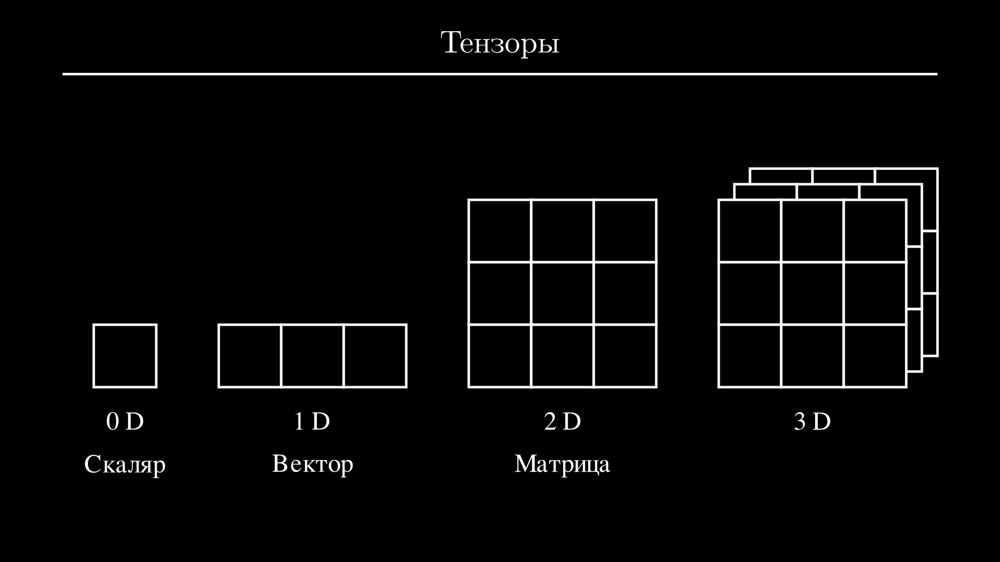
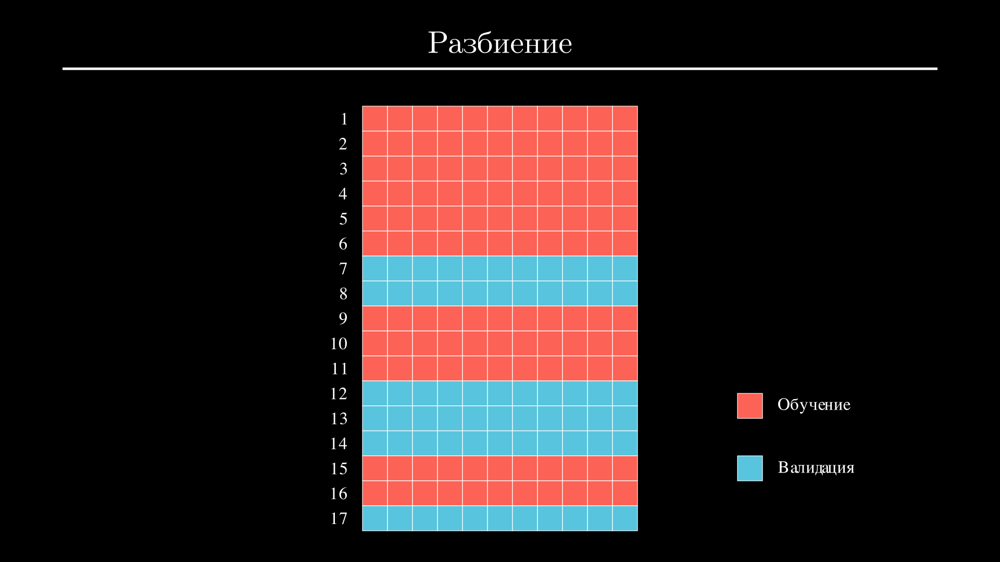
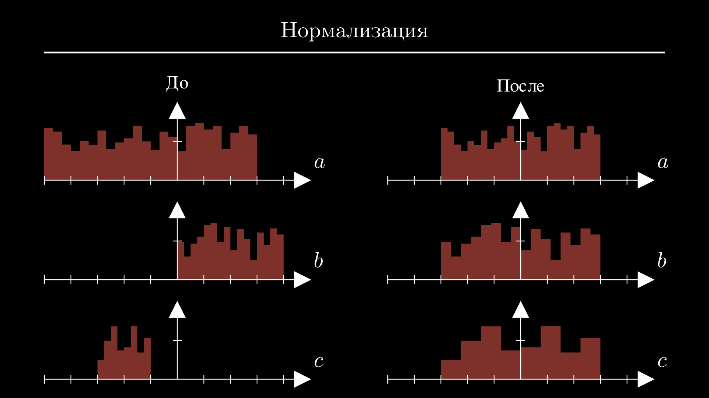
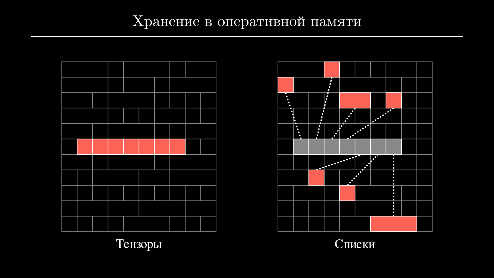
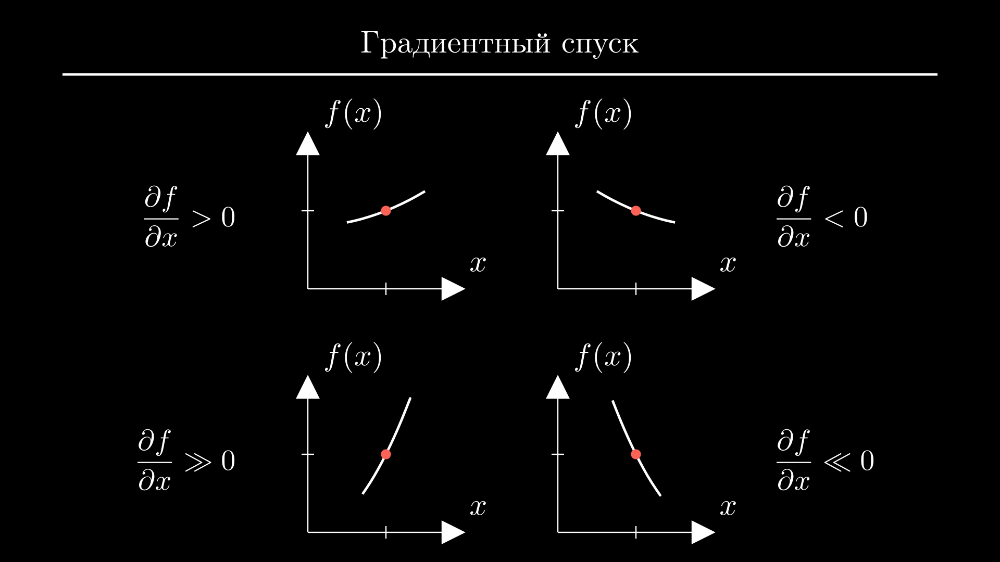
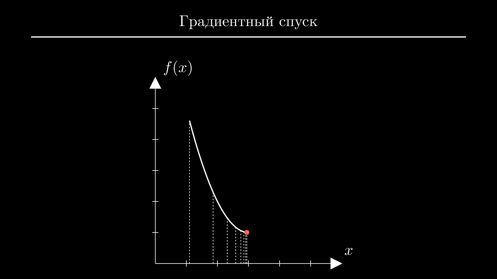

# PyTorch с нуля — тензоры и нейросети


Разбираемся с нуля в одной из самых популярных библиотек для работы с нейронными сетями. Опустимся на уровень ниже готовых моделей, слоев и оптимизаторов, узнаем как устроен PyTorch и обучим нейронную сеть, используя только векторы и матрицы.

<!-- more -->

## Тензоры {#tensors}

Библиотеки редко представляют собой коллекцию равноценных объектов. Большинство имеет многослойную архитектуру, в центре который находится главный объект, выполняющий все основные операции. Хороший разработчик может не знать наизусть имена всех методов, но он понимает сильные и слабые стороны этого объекта. Это позволяет писать более эффективный код и быстро исправлять ошибки.

PyTorch построен именно так, и его основным объектом является тензор. Тензор — это термин из линейной алгебры, который обобщает несколько других. К тензорам относятся обычные числа или *скаляры* (их называют нульмерными тензорами), векторы (одномерные тензоры), матрицы (двумерные тензоры) и тензоры более высокого ранга, у которых нет специальных названий:



На практике скаляры могут использовать для метрик модели, например оценки ее точности. Векторы могут содержать параметры конкретного объекта, например рост, вес и возраст человека, а матрицы — те же данные, но для всей выборки — например, данные ста человек. Тензоры более высокого ранга используются для изображений, видео и других видов данных.

С точки зрения программирования тензоры являются многомерными массивами, но конкретная реализация в PyTorch имеет несколько особенностей, которые мы здесь и разберем.

Для начала установим PyTorch. Для этого разработчики рекомендуют выбрать нужную команду через конфигуратор на [официальном сайте :octicons-link-external-16:](https://pytorch.org/get-started/locally/){:target="_blank"}. Но если у вас нет видеокарты от NVidia или вы не хотите сейчас устанавливать на нее драйвера с поддержкой CUDA, будет достаточно выполнить команду:

```shell
pip3 install torch
```

Подождем окончания установки, импортируем `torch` в шапке модуля и попробуем создать несколько тензоров: для этого вызываем функцию `tensor` со списком чисел. Можно использовать целые числа и числа с плавающей точкой. В конце выведем оба тензора на экран:

```python
import torch

a = torch.tensor([1, 2, 3])
b = torch.tensor([0.6, 1.2, 0.9])
print(a)
print(b)
```
```{.text .no-copy}
tensor([1, 2, 3])
tensor([1.2000, 3.6000, 2.4000])
```

Большая часть работы нейронных сетей построена на базовых математических операциях между тензорами, таких как сложение и умножение. Для них не нужно писать циклы: работайте с тензорами так же как работали бы с числами. Например, умножим тензор `a` на 3 и возведем тензор `b` в квадрат:

```python
import torch

a = torch.tensor([1, 2, 3])
b = torch.tensor([0.6, 1.2, 0.9])
c = a * 3
d = b ** 2
print(c)
print(d)
```
```{.text .no-copy}
tensor([3, 6, 9])
tensor([0.3600, 1.4400, 0.8100])
```

PyTorch повторит операцию между числом и каждым элементом тензора.

Точно также работают операции между двумя тензорами одинакового размера. Попробуем сложить `a` и `b`:

```python
import torch

a = torch.tensor([1, 2, 3])
b = torch.tensor([0.6, 1.2, 0.9])
c = a + b
print(c)
```
```{.text .no-copy}
tensor([1.6000, 3.2000, 3.9000])
```

В результате получим тензор `c`, каждый элемент которого будет равен сумме элементов `a` и `b` на соответствующих позициях.

В некоторых задачах могут потребоваться базовые статистики, такие как среднее или стандартное отклонение. Их можно вычислить с помощью методов: метод `mean` возвращает среднее, а `std` — стандартное отклонение:

```python
import torch

a = torch.tensor([1, 2, 3])
b = torch.tensor([0.6, 1.2, 0.9])
print(b.mean())
print(b.std())
```
```{.text .no-copy}
tensor(0.9000)
tensor(0.3000)
```

Базовые операции можно комбинировать с подсчетом статистик для вычисления ошибок или метрик. Например, чтобы получить средний квадрат отклонения между тензорами `a` и `b` сначала создадим тензор `error`, равный квадрату их разности, а затем вычислим его среднее с помощью метода `mean`:

```python
import torch

a = torch.tensor([1, 2, 3])
b = torch.tensor([0.6, 1.2, 0.9])
error = (a - b) ** 2
print(error.mean())
```
```{.text .no-copy}
tensor(1.7367)
```

Мы разобрали операции на примере векторов, но они касаются и тензоров более высокого ранга, например матриц. Для создания матрицы нужно передать функции `tensor` вложенный список чисел (внутренние списки будут строками матрицы). Создадим пару матриц размером $(2 \times 2)$ и выведем их на экран:

```python
import torch

a = torch.tensor([[0.4, 1.8], [0.1, 1.4]])
b = torch.tensor([[0.6, 1.2], [0.9, 1.6]])
print(a)
print(b)
```
```{.text .no-copy}
tensor([[0.4000, 1.8000],
        [0.1000, 1.4000]])
tensor([[0.6000, 1.2000],
        [0.9000, 1.6000]])
```

Так же как и векторы, их можно сложить, умножить или возвести в степень:

```python
import torch

a = torch.tensor([[0.4, 1.8], [0.1, 1.4]])
b = torch.tensor([[0.6, 1.2], [0.9, 1.6]])
c = 2 * (a + b)
print(c)
```
```{.text .no-copy}
tensor([[2., 6.],
        [2., 6.]])
```

Кроме поэлементных операций для матриц определена операция матричного произведения — для нее используется собака (`@`):

```python
import torch

a = torch.tensor([[0.4, 1.8], [0.1, 1.4]])
b = torch.tensor([[0.6, 1.2], [0.9, 1.6]])
c = a @ b
print(c)
```
```{.text .no-copy}
tensor([[1.8600, 3.3600],
        [1.3200, 2.3600]])
```

Результатом будет сумма произведений строк левой матрицы и колонок правой матрицы. В нейронных сетях эту операцию используют для подсчета взвешенной суммы всех признаков объекта, чтобы получить предсказание или новые признаки. Позже мы используем ее на практике.

Операции для подсчета статистик работают с матрицами так же как и с векторами и применяются к матрице целиком. Например, вызов метода `mean` возвращает среднее всех элементов:

```python
import torch

a = torch.tensor([[0.4, 1.8], [0.1, 1.4]])
print(a.mean())
```
```{.text .no-copy}
tensor(0.9250)
```

Но при работе с матрицами у нас есть возможность вычислить среднее и другие статистики отдельно для строк или колонок. Для этого нужно передать соответствующему методу в качестве аргумента порядок оси, которая будет свернута. Например, чтобы вычислить среднее в каждой колонке, нужно свернуть все строки — в этом случае передаем 0:

```python
import torch

a = torch.tensor([[0.4, 1.8], [0.1, 1.4]])
print(a.mean(0))
```
```{.text .no-copy}
tensor([0.2500, 1.6000])
```

Все эти операции будут составлять основную часть нашего кода и позволят справиться с большинством задач. Чуть позже поговорим о том, чего еще не хватает для обучения нейронных сетей, а пока предлагаю перейти к практике и разобраться, как выглядят первые шаги в реальном проекте.

## Подготовка данных {#data}

Сегодня выполним небольшой проект по оценке качества вина. У нас есть набор данных 6500 бутылок португальского вина *Vinho Verde* разных производителей и ценового сегмента [Cortez et al., 2009]. Каждая бутылка была проанализирована в лаборатории и прошла слепую дегустацию жюри из трех сомелье. Таким образом, у нас есть 11 химических параметров, таких как содержание алкоголя, сахара и консервантов, и итоговая оценка жюри от 0 до 10 баллов. Именно ее нам и предстоит определить по параметрам вина.

Если хотите выполнять все действия вместе со мной, скачайте файлы [:material-file: wine-red.pt](../static/posts/torch/wine-red.pt){:download=wine-red.pt} и [:material-file: wine-white.pt](../static/posts/torch/wine-white.pt){:download=wine-white.pt} и положите в папку с проектом. В первом файле находятся данные красных вин, а во втором — белых, но набор и порядок колонок в обоих файлах идентичны.

Обычно работу над проектом начинают с разведочного анализа и очистки данных, но в нашем случае все довольно просто. В данных нет ни пропусков, ни выбросов, и каждый из 11 параметров в той или иной степени коррелирует с результатом. Поэтому мы можем оставить данные как есть и сосредоточиться на следующих шагах — разбиении и нормализации.

Для наглядности рассмотрим все действия на небольшой матрице прежде чем работать с полным набором данных:

```python
import torch

data = torch.tensor([
    [0.076, 34.0, 5.0],
    [0.098, 67.0, 5.0],
    [0.092, 54.0, 5.0],
    [0.075, 60.0, 6.0],
])
```

Для начала посмотрим, как и зачем делается разбиение. Нейронные сети и другие модели никогда не обучают на всем наборе данных, потому что в этом случае не останется возможности проверить, что модель дает адекватные предсказания на незнакомых данных. Вместо этого из набора данных случайным образом выбирают от 50% до 90% объектов для обучения модели, а оставшуюся часть используют для валидации — на них модель не обучают, а только проверяют:



На практике обычно проще сначала перемешать матрицу исходных данных, а затем взять нужное количество строк с конца и с начала:


В PyTorch оба этих действия можно выполнить с помощью индексации. Индексация в тензорах работает так же, как и в списках — чтобы получить строку матрицы, нужно передать ее номер в квадратных скобках:

```python
import torch

data = torch.tensor([
    [0.076, 34.0, 5.0],
    [0.098, 67.0, 5.0],
    [0.092, 54.0, 5.0],
    [0.075, 60.0, 6.0],
])
print(data[3])
```
```{.text .no-copy}
tensor([ 0.0750, 60.0000,  6.0000])
```

Каждая строка также будет тензором.

Вместо одного индекса можно передать любую последовательность индексов. Например, выведем матрицу в обратном порядке:

```python
import torch

data = torch.tensor([
    [0.076, 34.0, 5.0],
    [0.098, 67.0, 5.0],
    [0.092, 54.0, 5.0],
    [0.075, 60.0, 6.0],
])
index = [3, 2, 1, 0]
print(data[index])
```
```{.text .no-copy}
tensor([[ 0.0750, 60.0000,  6.0000],
        [ 0.0920, 54.0000,  5.0000],
        [ 0.0980, 67.0000,  5.0000],
        [ 0.0760, 34.0000,  5.0000]])
```

Чтобы перейти к случайному порядку, используем функцию `randperm` — она ожидает целое число и возвращает тензор целых чисел от нуля до заданного числа в случайном порядке. Попробуем запустить код несколько раз: 

```python
import torch

data = torch.tensor([
    [0.076, 34.0, 5.0],
    [0.098, 67.0, 5.0],
    [0.092, 54.0, 5.0],
    [0.075, 60.0, 6.0],
])
index = torch.randperm(4)
print(index)
```
```{.text .no-copy}
tensor([2, 3, 1, 0])
```

Каждый раз мы будем получать индексы в разной последовательности. 

Теперь используем тензор `index` в качестве индекса, чтобы переставить строки исходной матрицы случайным образом:

```python
import torch

data = torch.tensor([
    [0.076, 34.0, 5.0],
    [0.098, 67.0, 5.0],
    [0.092, 54.0, 5.0],
    [0.075, 60.0, 6.0],
])
index = torch.randperm(4)
data = data[index]
print(data)
```
```{.text .no-copy}
tensor([[ 0.0750, 60.0000,  6.0000],
        [ 0.0920, 54.0000,  5.0000],
        [ 0.0760, 34.0000,  5.0000],
        [ 0.0980, 67.0000,  5.0000]])
```

Перемешанную матрицу осталось разделить — для этого пользуются срезами. Присвоим первые две строки переменной `train_data` и оставшиеся две — переменной `val_data`. Выведем обе матрицы на экран:

```python
import torch

data = torch.tensor([
    [0.076, 34.0, 5.0],
    [0.098, 67.0, 5.0],
    [0.092, 54.0, 5.0],
    [0.075, 60.0, 6.0],
])
index = torch.randperm(4)
data = data[index]
train_data, val_data = data[:2], data[2:]
print(train_data)
print(val_data)
```
```{.text .no-copy}
tensor([[ 0.0980, 67.0000,  5.0000],
        [ 0.0750, 60.0000,  6.0000]])
tensor([[ 0.0920, 54.0000,  5.0000],
        [ 0.0760, 34.0000,  5.0000]])
```

Позже нам понадобится разделить матрицу не только горизонтально, но и вертикально, чтобы отделить признаки от истинных значений. Сделать это также можно с помощью индексации. Для этого передаем пустой срез по первой оси (то есть берем все строки) и нужный срез по второй — с его помощью выбираем колонки:

```python
import torch

data = torch.tensor([
    [0.076, 34.0, 5.0],
    [0.098, 67.0, 5.0],
    [0.092, 54.0, 5.0],
    [0.075, 60.0, 6.0],
])
index = torch.randperm(4)
data = data[index]
train_data, val_data = data[:2], data[2:]
X_train, y_train = train_data[:, :-1], train_data[:, -1:]
print(X_train)
print(y_train)
```
```{.text .no-copy}
tensor([[ 0.0920, 54.0000],
        [ 0.0760, 34.0000]])
tensor([[5.],
        [5.]])
```

Получаем две матрицы: первая содержит все колонки матрицы `train_data` кроме последней, а вторая — только последнюю.

Теперь поговорим о нормализации. Вы могли заметить, что каждая колонка имеет разный диапазон значений. Это происходит, потому что каждый параметр измеряется в разных единицах и имеет свои физические пределы. Проблема в том, что признаки с наибольшими значениями будут расцениваться алгоритмом обучения как более важные. Это приведет к ухудшению метрик модели. Чтобы этого избежать, значения в каждой колонке приводят к одинаковому диапазону с помощью сдвига и масштабирования. Этот процесс называют нормализацией:



Один из самых распространенных способов нормализации заключается в том, чтобы вычесть из каждой колонки среднее значение и разделить результат на стандартное отклонение:

$$
\begin{gather}
\mathbf{x} = \frac{\mathbf{x} - \mu}{\sigma}, \\
\mu = \frac{1}{m}\sum_{i=1}^m \mathbf{x}_i,\quad
\sigma = \frac{1}{n - 1} \sum_{i=1}^m (\mathbf{x}_i - \mu)^2.
\end{gather}
$$

Тогда большинство значений будет находиться в диапазоне $[-3; +3]$.

Вычислим среднее и стандартное отклонение с помощью методов `mean` и `std`. Передаем 0 в качестве аргумента, чтобы посчитать значения в каждой колонке:

```python
import torch

data = torch.tensor([
    [0.076, 34.0, 5.0],
    [0.098, 67.0, 5.0],
    [0.092, 54.0, 5.0],
    [0.075, 60.0, 6.0],
])
mean = data.mean(0)
std = data.std(0)
print(mean)
print(std)
```
```{.text .no-copy}
tensor([ 0.0853, 53.7500,  5.2500])
tensor([1.1529e-02, 1.4198e+01, 5.0000e-01])
```

Для нормализации вычитаем из исходной матрицы средние значения и делим разность на стандартное отклонение:

```python
import torch

data = torch.tensor([
    [0.076, 34.0, 5.0],
    [0.098, 67.0, 5.0],
    [0.092, 54.0, 5.0],
    [0.075, 60.0, 6.0],
])
mean = data.mean(0)
std = data.std(0)
data = (data - mean) / std
print(data)
```
```{.text .no-copy}
tensor([[-0.8023, -1.3910, -0.5000],
        [ 1.1059,  0.9332, -0.5000],
        [ 0.5855,  0.0176, -0.5000],
        [-0.8891,  0.4402,  1.5000]])
```

Теперь значения в каждой колонке находятся примерно в одном и том же диапазоне.

К сожалению, в нормализованном виде прочитать данные невозможно. Но мы всегда можем посчитать исходные значения с помощью обратной операции. Умножим данные на стандартное отклонение и добавим среднее:

```python
import torch

data = torch.tensor([
    [0.076, 34.0, 5.0],
    [0.098, 67.0, 5.0],
    [0.092, 54.0, 5.0],
    [0.075, 60.0, 6.0],
])
mean = data.mean(0)
std = data.std(0)
data = (data - mean) / std
print(data * std + mean)
```
```{.text .no-copy}
tensor([[ 0.0760, 34.0000,  5.0000],
        [ 0.0980, 67.0000,  5.0000],
        [ 0.0920, 54.0000,  5.0000],
        [ 0.0750, 60.0000,  6.0000]])
```

Получаем исходную матрицу.

Теперь мы знаем все, чтобы выполнить подготовку данных от начала до конца. Загрузим данные красного вина. Для этого вызываем функцию `load` и передаем ей имя файла в качестве аргумента:

```python
import torch

data = torch.load("wine-red.pt")
print(data)
```
```{.text .no-copy}
tensor([[ 7.4000,  0.7000,  0.0000,  ...,  0.5600,  9.4000,  5.0000],
        [ 7.8000,  0.8800,  0.0000,  ...,  0.6800,  9.8000,  5.0000],
        [ 7.8000,  0.7600,  0.0400,  ...,  0.6500,  9.8000,  5.0000],
        ...,
        [ 6.3000,  0.5100,  0.1300,  ...,  0.7500, 11.0000,  6.0000],
        [ 5.9000,  0.6450,  0.1200,  ...,  0.7100, 10.2000,  5.0000],
        [ 6.0000,  0.3100,  0.4700,  ...,  0.6600, 11.0000,  6.0000]])
```

PyTorch не отображает большие тензоры полностью. Чтобы понять, сколько в тензоре `data` строк и колонок, выведем на экран его атрибут `shape`:

```python
import torch

data = torch.load("wine-red.pt")
print(data.shape)
```
```{.text .no-copy}
torch.Size([1599, 12])
```

Он показывает, что тензор содержит 1599 строк (это общий размер набора данных) и 12 колонок: 11 колонок признаков и одна колонка с оценкой сомелье — она находится в конце.

Сначала перемешаем данные. Для этого создаем случайную последовательность индексов с помощью функции `randperm`, передаем ей количество строк матрицы и сразу же используем результат:

```python
import torch

data = torch.load("wine-red.pt")
index = torch.randperm(data.shape[0])
data = data[index]
```

Перемешанную матрицу сначала разделяем на матрицу признаков и матрицу истинных значений, затем в каждой матрице выбираем первые 1000 строк для обучения, а оставшиеся строки оставляем для валидации. Вы можете использовать другое количество строк, но не делайте набор валидации слишком маленьким. Выведем размеры каждой из четырех полученных матриц на экран:

```python hl_lines="7-11"
import torch

data = torch.load("wine-red.pt")
index = torch.randperm(data.shape[0])
data = data[index]

X, y = data[:, :-1], data[:, -1:]
X_train, X_val = X[:1000], X[1000:]
y_train, y_val = y[:1000], y[1000:]
print(X_train.shape, y_train.shape)
print(X_val.shape, y_val.shape)
```
```{.text .no-copy}
torch.Size([1000, 11]) torch.Size([1000, 1])
torch.Size([599, 11]) torch.Size([599, 1])
```

Все выглядит нормально: матрицы признаков содержат по 11 колонок, а матрицы истинных значений — по одной.

Осталось выполнить нормализацию. И здесь есть пара нюансов. Во-первых, нормализации мы подвергаем только признаки, целевые значения нужно оставить как есть. Иногда их могут нормализовать или логарифмировать если они принимают слишком большие значения, но это не наш случай. Во-вторых, среднее и стандартное отклонение нужно вычислить только для выборки обучения (то есть переменной `X_train`) и использовать полученные значения для нормализации обеих выборок:

```python hl_lines="11-14"
import torch

data = torch.load("wine-red.pt")
index = torch.randperm(data.shape[0])
data = data[index]

X, y = data[:, :-1], data[:, -1:]
X_train, X_val = X[:1000], X[1000:]
y_train, y_val = y[:1000], y[1000:]

mean = X_train.mean(0)
std = X_train.std(0)
X_train = (X_train - mean) / std
X_val = (X_val - mean) / std
```

Нельзя нормализовывать всю выборку до разбиения — это приведет к просачиванию части информации из выборки валидации в выборку обучения. Также нельзя нормализовывать выборки по отдельности, иначе одни и те же значения в выборке обучения и выборке валидации могут стать разными после нормализации.

Теперь осталось только сохранить все тензоры. Делаем это с помощью функции `save` — передаем ей тензор и имя файла с расширением `.pt`. Повторяем для всех четырех тензоров:

```python hl_lines="16-19"
import torch

data = torch.load("wine-red.pt")
index = torch.randperm(data.shape[0])
data = data[index]

X, y = data[:, :-1], data[:, -1:]
X_train, X_val = X[:1000], X[1000:]
y_train, y_val = y[:1000], y[1000:]

mean = X_train.mean(0)
std = X_train.std(0)
X_train = (X_train - mean) / std
X_val = (X_val - mean) / std

torch.save(X_train, "X_train.pt")
torch.save(y_train, "y_train.pt")
torch.save(X_val, "X_val.pt")
torch.save(y_val, "y_val.pt")
```

Перед началом обучения нам останется только загрузить подготовленные тензоры с помощью функции `load`. В общем случае стоило бы также сохранить тензоры `mean` и `std` — без них не получится нормализовать новые данные. Можете сделать это по своему усмотрению. А для практики можете таким же образом обработать и сохранить данные белого вина.

## PyTorch и NumPy {#numpy}

Нам осталось обсудить несколько особенностей тензоров, связанных с обучением нейронных сетей. Но перед этим предлагаю немного порефлексировать на тему места PyTorch в Python экосистеме.

Если вы изучаете Python уже некоторое время, то могли слышать о NumPy. Это одна из самых старых Python библиотек, первый релиз которой состоялся еще 2006 году. NumPy часто используется в Data Science проектах, а в ее основе лежат *массивы* — объекты, очень похожие на тензоры.

Особенно поражают сходства в интерфейсе — некоторые функции и методы в PyTorch и NumPy называются одинаково и делают то же самое. Иногда достаточно заменить `torch.tensor` на `np.array`, и код будет работать:

=== "PyTorch"

    ```python
    import torch
    
    a = torch.tensor([1.0, 2.0, 3.0])
    print(a.shape)
    print(a - a.mean())
    ```
    ```{.text .no-copy}
    torch.Size([3])
    tensor([-1.,  0.,  1.])
    ```

=== "NumPy"

    ```python
    import numpy as np
    
    a = np.array([1.0, 2.0, 3.0])
    print(a.shape)
    print(a - a.mean())
    ```
    ```{.text .no-copy}
    (3,)
    [-1.  0.  1.]
    ```

Эти сходства легко объяснить: разработчики PyTorch отлично знали, что многие пользователи уже знакомы с NumPy, и похожий интерфейс помог бы им быстрее адаптироваться. Но не совсем понятно, зачем было переписывать NumPy вместо того, чтобы использовать его как зависимость и просто дополнить библиотеку компонентами для работы с нейронными сетями. К тому же, этот подход уже успешно использовали создатели SciPy, Scikit-learn и Pandas.

Причина в том, что в отличие от тензоров NumPy массивы никогда не поддерживали две операции, которые необходимы для работы с нейронными сетями: *автоматическое дифференцирование* и *вычисления на видеокартах*. Предлагаю разобрать эти операции по порядку и перейти к обучению нейронных сетей.

## Хранение тензоров {#storage}

Сначала обсудим вычисления на видеокартах и то, как тензоры хранятся в памяти. Заодно если вы не знали, как Python поддерживает смешанные типы данных в списках, будет отличная возможность об этом поговорить.

В классической реализации массив представляет собой структуру данных, для которой заранее выделяется непрерывный участок памяти, разбитый на ячейки равного размера. Это позволяет хранить несколько объектов одного типа и быстро получать к ним доступ. В PyTorch и NumPy используется именно такой подход:



Но эта модель идет вразрез с динамической типизацией Python, поэтому хранение списков устроено немного по-другому. Данные в списках хранятся свободно, так же как и другие объекты, а списки представляют собой массивы *указателей* на эти объекты. Это позволяет хранить в списках объекты любого типа.

В общем случае списками пользоваться удобнее, но они занимают больше памяти и работают намного медленнее. Для примера сравним скорость сложения двух массивов из 100 миллионов чисел. Списки нужно складывать через циклы, например создавая пары на ходу. А для тензоров будет достаточно использовать оператор сложения. В обоих случаях засекаем время прямо перед началом операции:

```python
import time
import torch

n = 100_000_000

a = list(range(n))
b = list(range(n))
start = time.time()
c = [x + y for x, y in zip(a, b)]
print(f"Списки: {time.time() - start:.2f} с")

a = torch.tensor(a)
b = torch.tensor(b)
start = time.time()
c = a + b
print(f"Тензоры: {time.time() - start:.2f} с")
```
```
Списки: 5.31 с
Тензоры: 0.94 с
```

Это не лучший тест, и конкретные результаты будут зависеть от многих факторов, но тензоры в любом случае окажутся намного быстрее.

Хранение тензоров в памяти имеет и другие особенности, к которым Python разработчики могут быть не готовы. В отличие от простых типов `int` и `float` в PyTorch используются типы с указанием разрядности. Тип данных тензора можно получить через атрибут `dtype`:

```python
import torch

a = torch.tensor([1, 2, 3])
b = torch.tensor([1.2, 3.6, 2.4])
print(a.dtype)
print(b.dtype)
```
```{.text .no-copy}
torch.int64
torch.float32
```

Числа 64 и 32 обозначают разрядность. Чем она выше, тем шире диапазон возможных значений числа и его точность. Например, 16-битные числа с плавающей точкой смогут представить число $\pi$ с точностью только до 2 знаков после запятой, 32-битные — до 7 знаков, а 64-битные — до 15 знаков. При этом числа с большей разрядностью занимают больше памяти и замедляют вычисления.

В PyTorch по умолчанию используются 32-битные числа с плавающей точкой для баланса точности и скорости основных операций. Целые числа используются намного реже. С ними не идут на компромиссы и хранят их со стандартной точностью 64 бита.

В большинстве случаев вам не придется думать о типах — PyTorch делает все возможное, чтобы выполнить операции между тензорами разных типов автоматически. В редких случаях, когда типы нужно привести вручную, используйте `int64` и `float32` вместо встроенных типов `int` и `float`. 

Посмотрим на несколько примеров. Большая часть операций между тензорами разных типов не вызовет ошибок:

```python
import torch

a = torch.tensor([1, 2, 3])
b = torch.tensor([1.2, 3.6, 2.4])
c = a + b
print(c)
print(c.dtype)
```
```{.text .no-copy}
tensor([2.2000, 5.6000, 5.4000])
torch.float32
```

Например, здесь при сложении PyTorch автоматически приводит типы `int64` и `float32` к более общему `float32`. Но в некоторых случаях это невозможно. Например, здесь операция составного присвоения закончится ошибкой:

```python
import torch

a = torch.tensor([1, 2, 3])
b = torch.tensor([1.2, 3.6, 2.4])
a += b
print(a)
```
```{.text .no-copy}
RuntimeError: result type Float can't be cast to the desired output type Long
```

Проблема в том, что мы не создаем новый тензор, а пытаемся записать результат операции `a + b` типа `float32` в исходный тензор `a` типа `int64`. Чтобы исправить ошибку, нужно сначала вручную привести тензор `a` к типу `float32`. Для этого вызываем метод `to` и используем тип `torch.float32` в качестве аргумента:

```python
import torch

a = torch.tensor([1, 2, 3])
b = torch.tensor([1.2, 3.6, 2.4])
a = a.to(torch.float32)
print(a.dtype)
```
```{.text .no-copy}
torch.float32
```

Теперь оба тензора имеют тип `float32`, и операция составного присвоения не вызовет ошибок:

```python
import torch

a = torch.tensor([1, 2, 3])
b = torch.tensor([1.2, 3.6, 2.4])
a = a.to(torch.float32)
a += b
print(a)
```
```{.text .no-copy}
tensor([2.2000, 5.6000, 5.4000])
```

Другие ошибки типизации можно встретить при использовании готовых компонентов PyTorch: функций потерь, слоев и оптимизаторов. Эти ошибки исправляются аналогично, а текст исключения подскажет вам, какой именно тензор имеет неправильный тип.

## Вычисления на видеокартах {#gpu}

Теперь поговорим о том, почему видеокарты постоянно упоминаются в контексте нейронных сетей, и как мы можем ускорить операции между тензорами.

Современные видеокарты состоят из тысяч слабых ядер. Эти ядра могут работать независимо и параллельно, но по отдельности они справляются только с примитивными операциями. Поэтому если исходную задачу можно разбить на большое количество простых независимых подзадач, ее выполнение на видеокарте займет намного меньше времени, чем на процессоре. Именно к таким задачам относится большинство операций между тензорами, в том числе те, которые используются при обучении нейронных сетей. 

PyTorch поддерживает вычисления на видеокартах и позволяет выбрать устройство для обработки каждого тензора независимо. Чтобы получить имя устройства, которое отвечает за операции с конкретным тензором, обратимся к его атрибуту `device`:

```python
import torch

a = torch.tensor([1, 2, 3])
print(a.device)
```
```{.text .no-copy}
cpu
```

По умолчанию каждый тензор обрабатывается процессором. Изменить устройство с помощью метода `to`, который мы уже использовали для изменения типа данных. В данном случае нужно передать в качестве аргумента строку с именем нового устройства. Для переноса на видеокарту используем строку `"cuda"`:

```python
import torch

a = torch.tensor([1, 2, 3])
a = a.to("cuda")
print(a.device)
```
```{.text .no-copy}
cuda:0
```

При вызове метод `to` создает копию тензора в памяти указанного устройства: в оперативной памяти для `cpu` и в видеопамяти для `cuda`.

Если у вас нет видеокарты, или вы используете видеокарту AMD или Intel, вместо результата вы можете получить следующую ошибку:

```{.text .no-copy}
AssertionError: Torch not compiled with CUDA enabled
```

Вы также можете получить ее, если установили неправильные драйвера или версию PyTorch. А иногда попытки заставить PyTorch работать в паре с видеокартой могут растянуться на несколько часов.

В любом из случаев вы можете рассмотреть альтернативный вариант — [Google Colab :octicons-link-external-16:](https://colab.google){:target="_blank"} или [Kaggle :octicons-link-external-16:](https://kaggle.com){:target="_blank"}. Обе площадки дают бесплатный доступ к видеокартам через Jupyter ноутбуки с подготовленной средой и установленными библиотеками. Там этот код выполнится без проблем.

При переносе части тензоров на видеокарту вы будете часто сталкиваться с одной и той же ошибкой. Например, мы можем ее получить, если умножим тензор `a` на тензор `b`:

```python
import torch

a = torch.tensor([1, 2, 3])
b = torch.tensor([4, 5, 6])
a = a.to("cuda")
c = a * b
print(c)
```
```{.text .no-copy}
RuntimeError: Expected all tensors to be on the same device,
but found at least two devices, cuda:0 and cpu!
```

Проблема в том, что тензор `a` находится в видеопамяти, а тензор `b` — в оперативной памяти. В этой ситуации PyTorch не пытается угадать, какое из двух устройств должно выполнять операцию, и требует перенести оба тензора на одно устройство.

Чтобы исправить ошибку, перенесем тензор `b` в видеопамять:

```python hl_lines="6"
import torch

a = torch.tensor([1, 2, 3])
b = torch.tensor([4, 5, 6])
a = a.to("cuda")
b = b.to("cuda")
c = a * b
print(c)
```
```{.text .no-copy}
tensor([ 4, 10, 18], device='cuda:0')
```

Так как оба тензора находились в видеопамяти, результат их операции тоже будет записан в видеопамять.

Теперь оценим скорость выполнения операций на процессоре и видеокарте на примере умножения матриц. Создадим две матрицы случайных чисел размером $(10^4 \times 10^4)$ с помощью функции `randn` — передаем ей количество строк и колонок. Засекаем время перед операцией и выводим время выполнения на экран. Повторяем то же самое для двух других матриц, но в этот раз переносим их на видеокарту:

```python
import time
import torch

n = 10_000
a = torch.randn(n, n)
b = torch.randn(n, n)
start = time.time()
c = a @ b
print(f"CPU: {time.time() - start:.3f} s")

a = torch.randn(n, n).to("cuda")
b = torch.randn(n, n).to("cuda")
start = time.time()
c = a @ b
print(f"GPU: {time.time() - start:.3f} s")
```
```{.text .no-copy}
CPU: 1.536 s
GPU: 0.046 s
```

Конкретные числа будут зависеть от комбинации процессора и видеокарты, но большинство операций будет выполняться в 10 или даже 100 раз быстрее.

## Авто-дифференцирование {#autodiff}

Прежде чем перейти к обучению нейронных сетей, обсудим еще одну часть функционала тензоров, которая поможет нам сократить количество ручной работы.

Нейронные сети обучаются с помощью градиентного спуска. Это алгоритм оптимизации, который позволяет найти минимум любой функции с помощью ее производной. Градиентный спуск начинается с выбора случайной точки. В этой точке вычисляется производная, а следующие действия зависят от ее модуля и знака:



Если производная принимает небольшое по модулю положительное значение, значение самой функции немного увеличивается с увеличением аргумента. В этом случае нужно немного уменьшить значение аргумента, чтобы прийти в точку с меньшим значением функции. Если производная наоборот, принимает небольшое по модулю отрицательное значение, нужно немного увеличить значение аргумента. А если модуль производной достаточно большой, значит функция резко изменяет значение и можно делать более широкие шаги.

Все четыре случая можно обобщить одной формулой:

$$
x \leftarrow x - \alpha \frac{\partial f}{\partial x}.
$$

То есть, нужно вычесть из значения аргумента производную функции по этому аргументу. Само значение производной в большинстве случаев слишком велико, поэтому его умножают на небольшое число, обозначенное здесь как $\alpha$. Его называют *коэффициентом обучения*. В зависимости от условий он может принимать значения от $10^{-4}$ до $10^{-1}$.

Если у функции несколько аргументов, каждый аргумент обновляют независимо, следуя той же формуле, а вместо термина *производная* используют термин *градиент*:

$$
\mathbf{x} \leftarrow \mathbf{x} - \alpha \nabla_{\mathbf{x}} f(\mathbf{x}),
$$

здесь $\mathbf{x}$ — вектор аргументов, а $\nabla_{\mathbf{x}} f(\mathbf{x})$ — градиент функции $f(\mathbf{x})$ по $\mathbf{x}$.

После перехода в новую точку все действия повторяются. Как правило делают достаточно большое количество итераций, либо отслеживают изменение функции и останавливают алгоритм, когда изменение становится незначительным:



При обучении нейронных сетей градиентный спуск используют для минимизации отклонения предсказаний модели от истинных значений, а роль аргументов выполняют параметры модели.

Исторически именно вычисление производных представляло значительные трудности. Первые попытки использования градиентных методов оптимизации были предприняты в 60-х, но надежный способ вычисления производных для многослойных моделей появился только 1974 году.

И если ранние исследователи вычисляли производные по каждому параметру вручную, современные библиотеки берут работу с производными на себя — это называется автоматическим дифференцированием. В PyTorch оно является частью внутреннего функционала тензоров.

PyTorch отслеживает операции между тензорами и позволяет в любой момент вычислить производную выражения по любому тензору, который в нем участвовал. Есть только два ограничения: результат выражения должен быть скаляром, а тензор, по которому мы хотим вычислить производную, должен быть помечен специальным флагом.

Чтобы стало понятнее, рассмотрим авто-дифференцирование на примере. Допустим, нам нужно вычислить производную функции $f=a^2$ в точке $a=2.5$. Для начала создадим тензор `a` — передадим конструктору `tensor` число 2.5 и флаг `requires_grad=True`: 

```python
import torch

a = torch.tensor(2.5, requires_grad=True)
print(a)
```
```{.text .no-copy}
tensor(2.5000, requires_grad=True)
```

Теперь PyTorch будет отслеживать все операции, в которых участвует `a` и сможет вычислить производную итогового выражения. В остальном `a` ведет себя как обычный тензор. Вычислим значение $f=a^2$, а для получения производной $\partial f/\partial a$ вызовем метод `backward`:

```python
import torch

a = torch.tensor(2.5, requires_grad=True)
f = a ** 2
print(f.backward())
```
```{.text .no-copy}
None
```

Получаем `None`, потому что вызов `backward` не возвращает производную, а записывает ее в тот тензор, по которому она была вычислена. Значение производной будет записано в атрибут `grad` тензора `a`:

```python
import torch

a = torch.tensor(2.5, requires_grad=True)
f = a ** 2
f.backward()
print(a.grad)
```
```{.text .no-copy}
tensor(5.)
```

Мы использовали очень простую функцию, но PyTorch справится с выражением любой сложности:

```python
import torch

a = torch.tensor(2.5, requires_grad=True)
f = a ** 2 + (2 * a - 5) / (10 - 2 * a) ** 2
f.backward()
print(a.grad)
```
```{.text .no-copy}
tensor(5.0800)
```

В выражении также может участвовать сколько угодно тензоров - один вызов `backward` вычислит производные по всем тензорам, помеченным флагом `requires_grad`:

```python
import torch

a = torch.tensor(2.5, requires_grad=True)
b = torch.tensor(1.5, requires_grad=True)
f = a ** 2 + (b - 4) ** 2
f.backward()
print(a.grad)
print(b.grad)
```
```{.text .no-copy}
tensor(5.)
tensor(-5.)
```

Значения `a` и `b` могут находиться в одном тензоре — обозначим его как `x` и обновим функцию: вместо `a` будет использоваться первый элемент `x`, а вместо `b` — второй. Результатом будет один тензор из двух элементов:

```python
import torch

x = torch.tensor([2.5, 1.5], requires_grad=True)
f = x[0] ** 2 + (x[1] - 4) ** 2
f.backward()
print(x.grad)
```
```{.text .no-copy}
tensor([ 5., -5.])
```

Теперь попробуем найти с помощью градиентного спуска такое значение вектора `x`, при котором величина `f` будет минимальной.

Для начала выберем случайное значение вектора `x`. Для этого вместо функции `tensor` вызываем функцию `randn` — она возвращает тензор заданного размера со случайными числами из нормального распределения. Так как нам нужно два числа, передаем двойку в качестве первого аргумента и флаг `requires_grad` — в качестве второго. Выведем значения `x` и `f` на экран:

```python
import torch

x = torch.randn(2, requires_grad=True)
f = x[0] ** 2 + (x[1] - 4) ** 2
print(x)
print(f)
```
```{.text .no-copy}
tensor([2.4218, 0.2978], requires_grad=True)
tensor(19.5717, grad_fn=<AddBackward0>)
```

При запуске получаем случайный вектор и соответствующее ему значение функции.

Возьмем коэффициент обучения $\alpha=0.1$ и выполним 50 итераций градиентного спуска. На каждой итерации вычисляем значение функции, ее производную и обновляем значение `x`, вычитая из него производную `f` по `x`, умноженную на коэффициент обучения. В конце цикла выводим текущее значение функции — с каждой итерацией оно становиться меньше. После цикла выводим значение `x`:

```python
import torch

x = torch.randn(2, requires_grad=True)
alpha = 0.1

for _ in range(50):
    f = x[0] ** 2 + (x[1] - 4) ** 2
    f.backward()
    x -= alpha * x.grad
    print(f"f(x)={f:.4f}")

print(f"Точка минимума: {x}")
```
```{.text .no-copy}
RuntimeError: a leaf Variable that requires grad
is being used in an in-place operation.
```

Первый запуск кода приводит к ошибке. Ее причина в том, что тензор `x` участвует в операции для вычисления самого себя, что делает невозможным вычисление производной. На самом деле нам и не нужно знать производную этой операции. 

Чтобы исправить ошибку, выполним операцию обновления `x` в контекстном менеджере `no_grad`: он сигнализирует PyTorch о том, что эту операцию не нужно рассматривать во время вычисления производных:

```python hl_lines="9 10"
import torch

x = torch.randn(2, requires_grad=True)
alpha = 0.1

for _ in range(50):
    f = x[0] ** 2 + (x[1] - 4) ** 2
    f.backward()
    with torch.no_grad():
        x -= alpha * x.grad
    print(f"f(x)={f:.4f}")

print(f"Точка минимума: {x}")
```
```{.text .no-copy}
f(x)=9.3827
f(x)=3.1391
...
f(x)=5.3016
Точка минимума: tensor([0.0040, 2.0071], requires_grad=True)
```

Теперь код работает, но полученное значение функции далеко от минимума, который должен быть равен нулю. Если внимательно посмотреть на значения функции во время итераций, можно заметить, что оно несколько раз снижается практически до нуля, но затем снова резко увеличивается.

Проблема в том, что PyTorch не обновляет значение производной на каждой итерации, а суммирует его с предыдущим. Поэтому мы сначала делаем шаги в правильном направлении, но вместо того, чтобы замедляться, постоянно набираем скорость и проскакиваем точку минимума, после чего пытаемся вернуться.

Некоторые оптимизаторы грамотно используют эффект набора скорости: одна из первых реализаций такого алгоритма принадлежит Юрию Нестерову. Но в нашем случае накопление производных с предыдущих шагов нарушает работу алгоритма. Чтобы избежать этого, необходимо вручную сбросить значение производной в конце каждой итерации. Для этого присваиваем атрибуту `grad` значение `None`:

```python hl_lines="11"
import torch

x = torch.randn(2, requires_grad=True)
alpha = 0.1

for _ in range(50):
    f = x[0] ** 2 + (x[1] - 4) ** 2
    f.backward()
    with torch.no_grad():
        x -= alpha * x.grad
    x.grad = None
    print(f"f(x)={f:.4f}")

print(f"Точка минимума: {x}")
```
```{.text .no-copy}
f(x)=11.4917
f(x)=4.1370
...
f(x)=0.0012
Точка минимума: tensor([-0.0079,  3.9811], requires_grad=True)
```

В таком варианте алгоритм корректно определяет точку минимума $(0; 4)$, в которой значение функции равно нулю.

## Нейросеть на тензорах {#nn}

Теперь мы знаем все операции для того, чтобы создать и обучить нейронную сеть для оценки качества вина. Начнем с простейшей нейронной сети с одним слоем: ее параметрами будут матрица весов $\mathbf{w}$ и вектор смещений $\mathbf{b}$.

Предсказание модели равно произведению матрицы признаков и матрицы весов, сложенному с вектором смещений:

$$
\hat{\mathbf{y}} = \mathbf{X} \mathbf{w} + \mathbf{b}.
$$

Чтобы понять, что здесь происходит, перепишем эту формулу в скалярной форме применительно к нашей задаче:

$$
\text{Оценка} = \mathbf{w}_1 \text{Алкоголь} + \mathbf{w}_2 \text{Кислотность} + \dots + b.
$$

Оценка вина равна сумме произведений обучаемых параметров модели $\mathbf{w}_i$ и значений признаков. Каждый из параметров характеризует положительное или негативное влияние признака на итоговую оценку вина. К сумме произведений добавляется смещение $\mathbf{b}$, которое можно интерпретировать как примерную оценку средней бутылки вина — не хорошего, но и не плохого. 

Нейронная сеть с большим количеством слоев будет иметь несколько матриц весов и смещений. Она вычислит взвешенные комбинации признаков несколько раз прежде чем делать предсказание. Мы обсуждали это более подробно в отдельном [разборе про нейронные сети](nn.md), поэтому если вам здесь что-то будет непонятно, можете туда заглянуть.

В процессе обучения мы будем подбирать значения параметров модели таким образом, чтобы уменьшить ее отклонение от реальных оценок сомелье на выборке обучения. Для этого мы будем искать минимум функции потерь с помощью градиентного спуска. Так как это задача регрессии, в качестве функции потерь используем средний квадрат отклонения между предсказаниями модели и истинными значениями:

$$
\mathcal{L}(\mathbf{X}, \mathbf{y}; \mathbf{w}, b) = \frac{1}{m} \sum_{i=1}^{m} (\hat{\mathbf{y}} - \mathbf{y})^2.
$$

Его величина зависит от самих данных, и двух матриц параметров модели $\mathbf{w}$ и $b$. Алгоритм градиентного спуска в этом случае будет выглядеть следующим образом:

$$
\begin{gather}
\mathbf{w} \leftarrow \mathbf{w} - \alpha \nabla_{\mathbf{w}} \mathcal{L},\\
b \leftarrow b - \alpha \nabla_{b} \mathcal{L}.\\
\end{gather}
$$

То есть, на каждой итерации мы будем вычитать из параметра градиент функции потерь по этому параметру, умноженный на коэффициент обучения.

Перейдем к практике. Для начала загрузим данные красного вина, которые мы подготовили на предыдущем шаге:

```python
import torch

X_train = torch.load("X_train.pt")
y_train = torch.load("y_train.pt")
X_val = torch.load("X_val.pt")
y_val = torch.load("y_val.pt")
```

Используем функцию `randn` для создания тензоров со случайными параметрами модели. Количество строк матрицы весов `w` должно совпадать с количеством признаков, а количество колонок — с количеством величин, которые предсказывает модель. В нашем случае это будет матрица $(11 \times 1)$. Вектор смещений `b` будет состоять из одного числа:

```python hl_lines="7 8"
import torch

X_train = torch.load("X_train.pt")
y_train = torch.load("y_train.pt")
X_val = torch.load("X_val.pt")
y_val = torch.load("y_val.pt")
W = torch.randn(11, 1, requires_grad=True)
b = torch.randn(1, requires_grad=True)
```

Вычислим предсказания модели на выборке обучения и сравним их размерность с размерностью матрицы истинных значений. Для этого выведем атрибуты `shape` обеих матриц на экран:

```python hl_lines="10 11 12"
import torch

X_train = torch.load("X_train.pt")
y_train = torch.load("y_train.pt")
X_val = torch.load("X_val.pt")
y_val = torch.load("y_val.pt")
W = torch.randn(11, 1, requires_grad=True)
b = torch.randn(1, requires_grad=True)

y_hat = X_train @ W + b
print(y_hat.shape)
print(y_train.shape)
```
```{.text .no-copy}
torch.Size([1000, 1])
torch.Size([1000, 1])
```

Предсказания модели вычисляются без проблем, а их размерность совпадает с размерностью матрицы истинных значений. Это значит, что можно двигаться дальше.

Вычислим средний квадрат отклонения между матрицей предсказаний и матрицей истинных значений и выведем результат на экран:

```python hl_lines="11 12"
import torch

X_train = torch.load("X_train.pt")
y_train = torch.load("y_train.pt")
X_val = torch.load("X_val.pt")
y_val = torch.load("y_val.pt")
W = torch.randn(11, 1, requires_grad=True)
b = torch.randn(1, requires_grad=True)

y_hat = X_train @ W + b
loss = ((y_hat - y_train) ** 2).mean()
print(loss)
```
```{.text .no-copy}
tensor(44.4544, grad_fn=<MeanBackward0>)
```

Его значение сейчас неважно. Главное, что мы получили скаляр и не получили ошибок при вычислении.

Пропишем шаги градиентного спуска. Используем коэффициент обучения, равный 0.01 и сделаем 1000 итераций. На каждой итерации вычислим предсказания модели, величину функции потерь и ее градиент. В контекстном менеджере `no_grad` обновим параметры модели и не сбросим градиенты перед следующей итерацией. В конце выводим текущее значение функции потерь:

```python hl_lines="9-20"
import torch

X_train = torch.load("X_train.pt")
y_train = torch.load("y_train.pt")
X_val = torch.load("X_val.pt")
y_val = torch.load("y_val.pt")
W = torch.randn(11, 1, requires_grad=True)
b = torch.randn(1, requires_grad=True)
alpha = 0.01

for _ in range(1000):
    y_hat = X_train @ W + b
    loss = ((y_hat - y_train) ** 2).mean()
    loss.backward()
    with torch.no_grad():
        W -= alpha * W.grad
        b -= alpha * b.grad
    W.grad = None
    b.grad = None
    print(f"Ошибка: {loss:.5f}")
```
```{.text .no-copy}
Ошибка: 42.31859
Ошибка: 40.26645
...
Ошибка: 0.39822
```

Видим, что значение функции потерь стабильно уменьшается. 

Осталось проверить модель на выборке валидации. Снова вычислим предсказания модели, но на этот раз используем контекстный менеджер `no_grad`, потому что значения производных нам уже не понадобятся. После этого посчитаем средний модуль разности предсказаний и истинных значений — это будет среднее отклонение модели от оценки сомелье в баллах:

```python hl_lines="21-24"
import torch

X_train = torch.load("X_train.pt")
y_train = torch.load("y_train.pt")
X_val = torch.load("X_val.pt")
y_val = torch.load("y_val.pt")
W = torch.randn(11, 1, requires_grad=True)
b = torch.randn(1, requires_grad=True)
alpha = 0.01

for _ in range(1000):
    y_hat = X_train @ W + b
    loss = ((y_hat - y_train) ** 2).mean()
    loss.backward()
    with torch.no_grad():
        W -= alpha * W.grad
        b -= alpha * b.grad
    W.grad = None
    b.grad = None

with torch.no_grad():
    y_hat = X_val @ W + b
score = (y_hat - y_val).abs().mean()
print(f"Среднее отклонение: {score:.2f} балла.")
```
```{.text .no-copy}
Среднее отклонение: 0.52 балла.
```

Получаем примерно полбалла. Это неплохой результат, но вы можете попробовать улучшить его. Для этого можно изменить количество шагов градиентного спуска, коэффициент обучения или использовать модель с большим количеством слоев. Пример обучения двухслойной модели можете найти в файле [:material-file: model.py](../static/posts/torch/model.py){:download=model.py}.

Если вы довольны результатом, параметры модели можно сохранить с помощью функции `save`.

В этом примере мы не переносили тензоры в видеопамять, потому что все обучение уже занимает меньше секунды. Но мы еще вернемся к операциям на видеокартах, когда будем разбирать более сложные проекты.

## Заключение {#end}

На этом предлагаю заканчивать. Я специально не включил в этот разбор готовые компоненты PyTorch, чтобы уделить все внимание возможностям тензоров и процессу обучения нейронных сетей. Если хотите посмотреть, как тот же код будет выглядеть с использованием готовых слоев, функций потерь и оптимизаторов, можете посмотреть [предыдущий разбор](nn.md). А в следующий раз мы поговорим обо всех готовых компонентах PyTorch и максимально приблизимся к уровню реальных Data Science проектов.

Поэтому добавляйте сайт в закладки, подписывайтесь на [YouTube канал :octicons-link-external-16:](https://www.youtube.com/channel/UCscWjyvPudzdIaGCCtEL3nw){:target="_blank"} и заходите пообщаться в [Telegram :octicons-link-external-16:](https://www.t.me/ml_mouse){:target="_blank"}. Увидимся в код ревью, всем пока!
